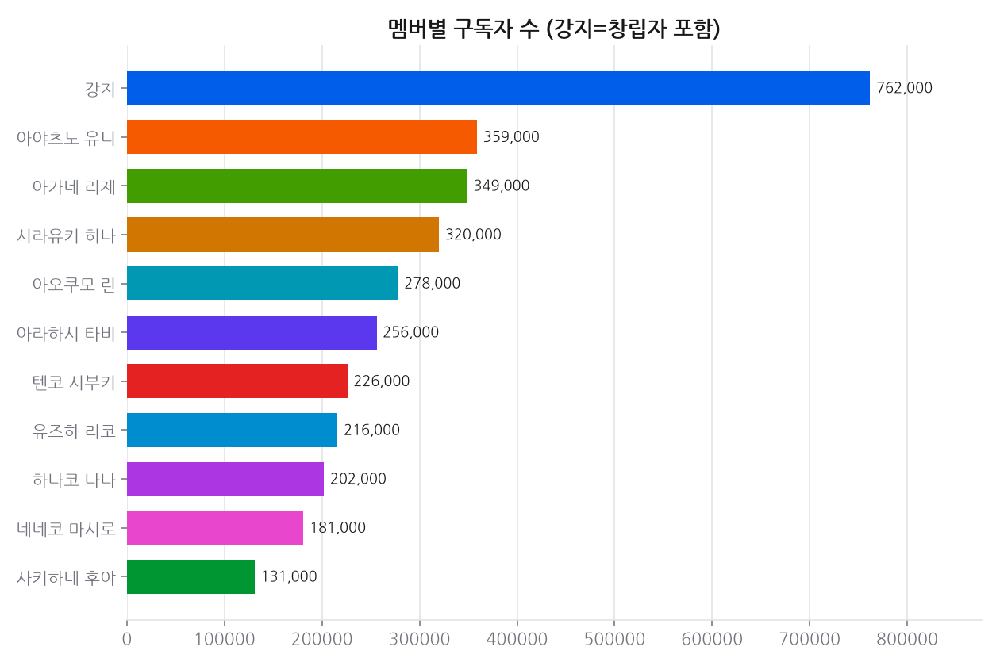
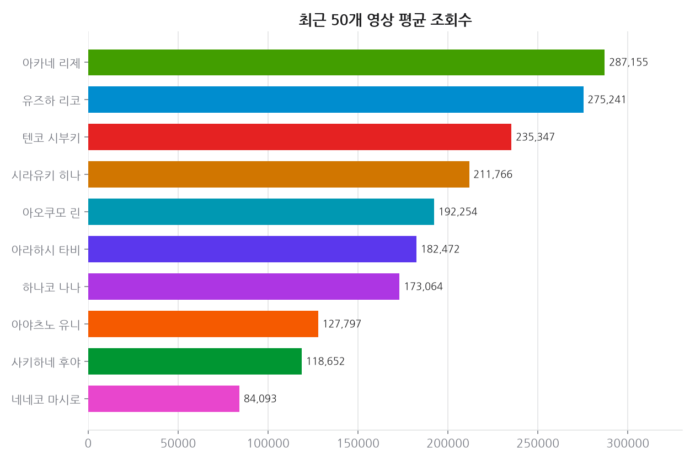
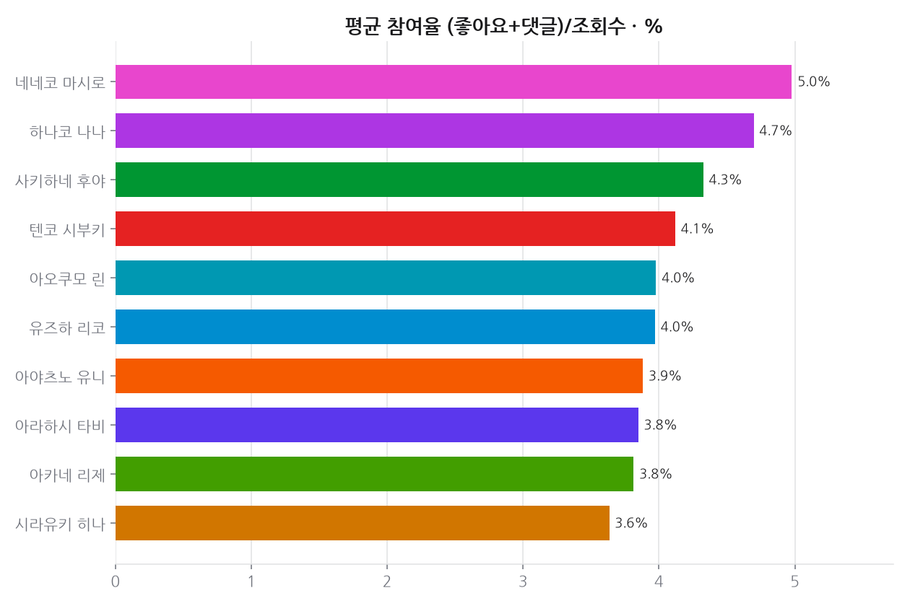
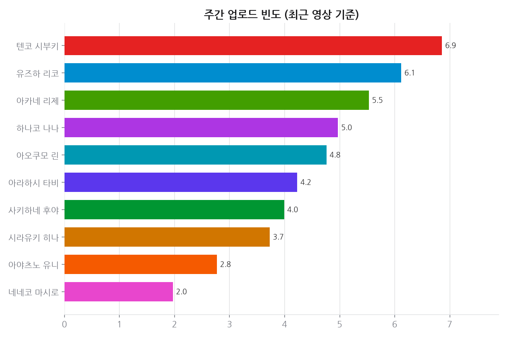
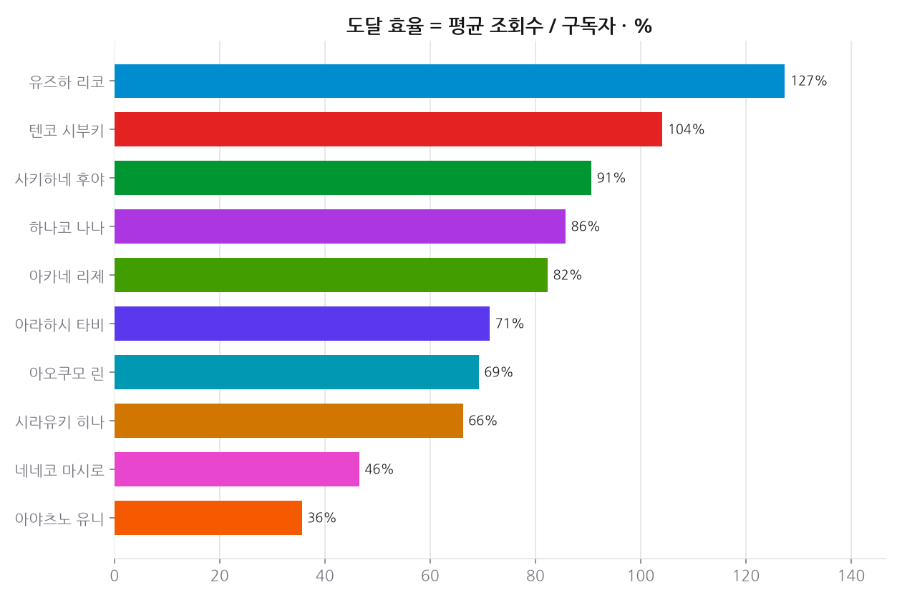
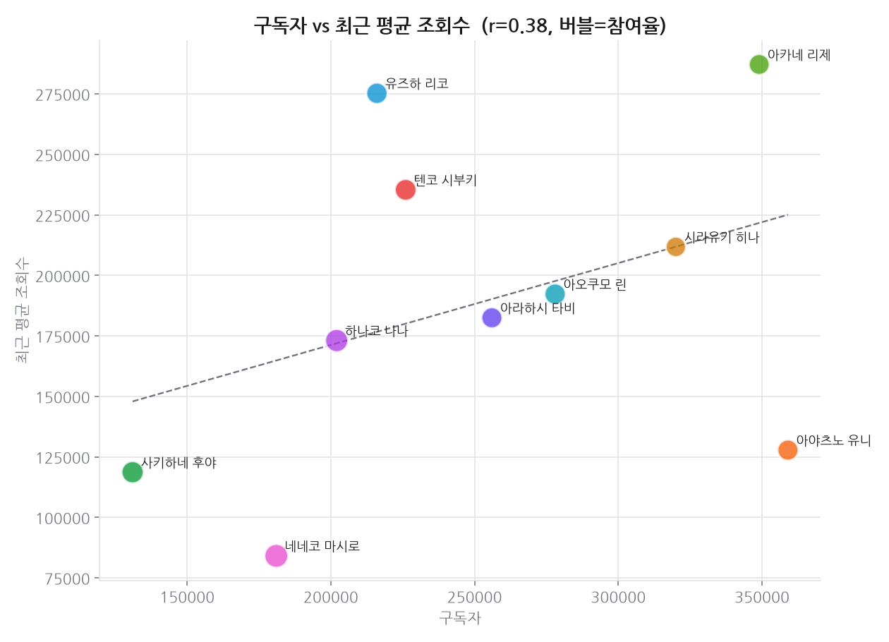
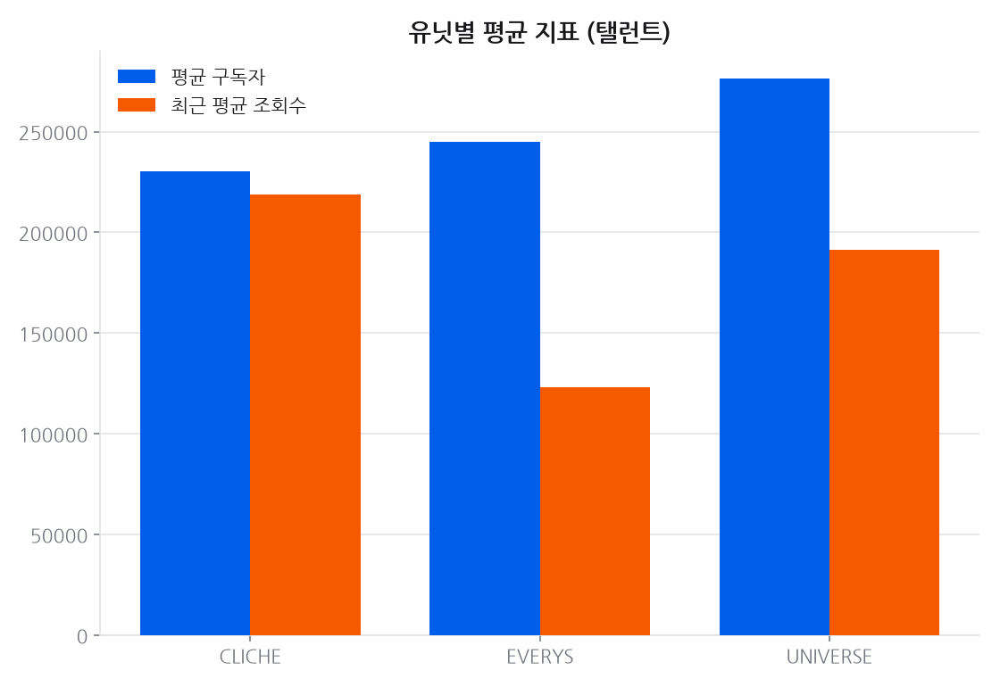
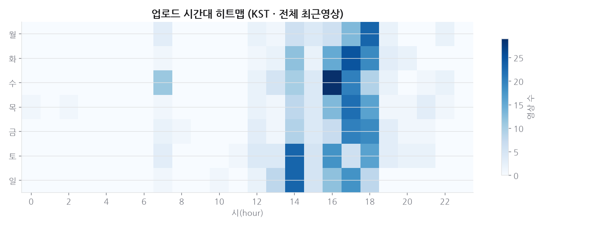

# 프로젝트 1 · 멤버별 유튜브 채널 성과

**기준 2026-08-18**  · 날짜별 축적

## 결론

규모와 밀도는 반대로 간다. 참여율과 구독자, 도달 효율과 구독자가 모두 **뚜렷한 음의 상관**이다(둘 다 -0.4 이하). 구독자가 많은 채널일수록 구독자 대비 조회수와 참여율이 낮다 — 팬덤이 커질수록 느슨해진다는 뜻이다. 반면 업로드 빈도와 평균 조회수는 **+0.8 안팎**으로 강하게 붙어 있어, 이 규모대에서는 물량이 조회수를 견인한다.

---

## 데이터

- 데이터 소스: YouTube Data API v3 (수집 2026-08-18)
- 대상: StelLive 멤버 11명(창립자 강지 포함), 채널당 최근 50개 영상
- 총 550개 영상 지표 집계

## 한눈에

- **최다 구독자(탤런트)**: 아야츠노 유니 — 359,000명
- **도달 효율 1위**(평균조회수/구독자): 유즈하 리코 — 127%
- **가장 부지런한 업로더**: 텐코 시부키 — 주 6.9회
- **참여율 1위**(좋아요+댓글/조회수): 네네코 마시로 — 5.0%

## 시간에 따른 변화

### 추세 · 구독자

축적 7일 (기준 2026-08-18)

| 멤버 | 1일(1d) |
|---|---:|
| 사키하네 후야 | +0.77% |
| 유즈하 리코 | +0.47% |
| 텐코 시부키 | +0.44% |
| 강지 | +0.00% |
| 네네코 마시로 | +0.00% |
| 시라유키 히나 | +0.00% |
| 아라하시 타비 | +0.00% |
| 아야츠노 유니 | +0.00% |
| 아오쿠모 린 | +0.00% |
| 아카네 리제 | +0.00% |
| 하나코 나나 | +0.00% |

> 유튜브 구독자는 API 가 1,000 단위로 반올림해 준다. 작은 채널은 하루에 0 또는 +1,000 으로만 움직여 짧은 창에서는 `+0.00%` 로 찍힌다. 실제로 안 늘어난 것이 아니라 반올림 경계를 안 넘은 것이다 — 짧은 구간은 치지직 팔로워(정확한 정수)를 같이 보는 편이 낫다.

## 상세 분석

### 상관관계 (탤런트 10명)

| 관계 | 상관계수 r |
|------|-----------|
| 구독자 ↔ 최근 평균 조회수 | 0.381 |
| 업로드 빈도 ↔ 구독자 | -0.034 |
| 업로드 빈도 ↔ 평균 조회수 | 0.827 |
| 참여율 ↔ 구독자 | -0.71 |
| 도달 효율 ↔ 구독자 | -0.407 |

> 해석 힌트: 구독자와 평균 조회수의 상관이 높으면 "구독자 규모가 조회수를 견인",
> 도달 효율↔구독자 상관이 음수면 "소규모 채널일수록 구독자 대비 조회수가 높은"
> (덜 포화된) 경향으로 읽을 수 있습니다.

## 근거 자료

### 차트 8종 (최신 실행 2026-08-18 기준)

## 원자료

이 리포트를 만든 코드와 데이터는 저장소의 [`youtube_analyze_all/01_member_channel_performance/`](../../youtube_analyze_all/01_member_channel_performance/) 에 있다.

| 경로 | 내용 |
|---|---|
| `collect.py` | 수집 |
| `analyze.py` | 정제·집계·차트 생성 |
| `data/` | 원천·정제 데이터 (CSV/JSON) |
| `sql/` | 스키마·INSERT·분석쿼리·SQLite·쿼리 실행결과 |
| `site/index.html` | 자체완결 인터랙티브 대시보드 |
| `data/history.csv` | 날짜별 지표 축적 (이 리포트의 추세 절 근거) |
