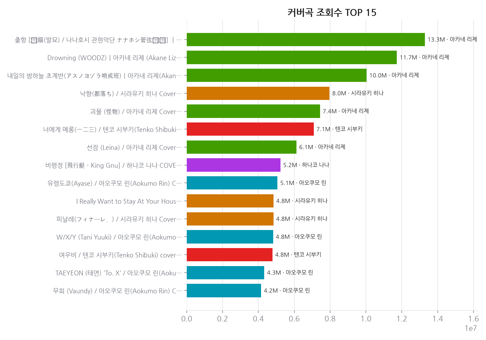
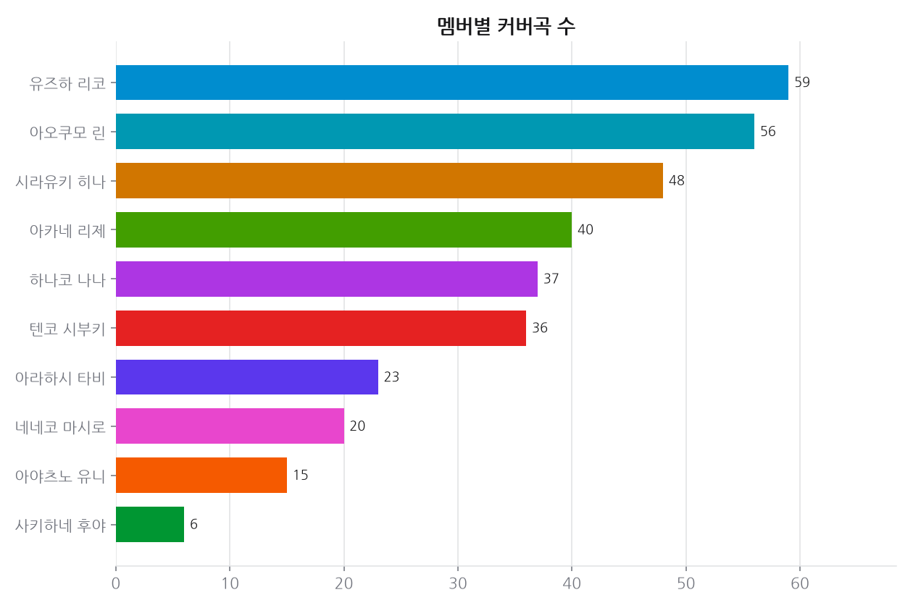
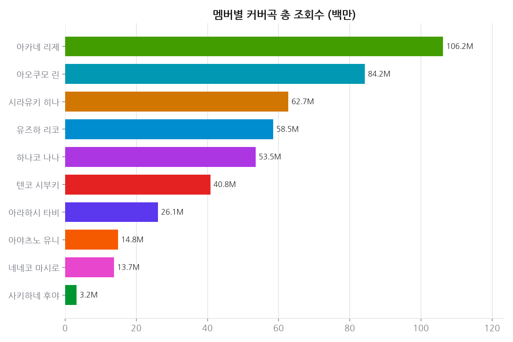
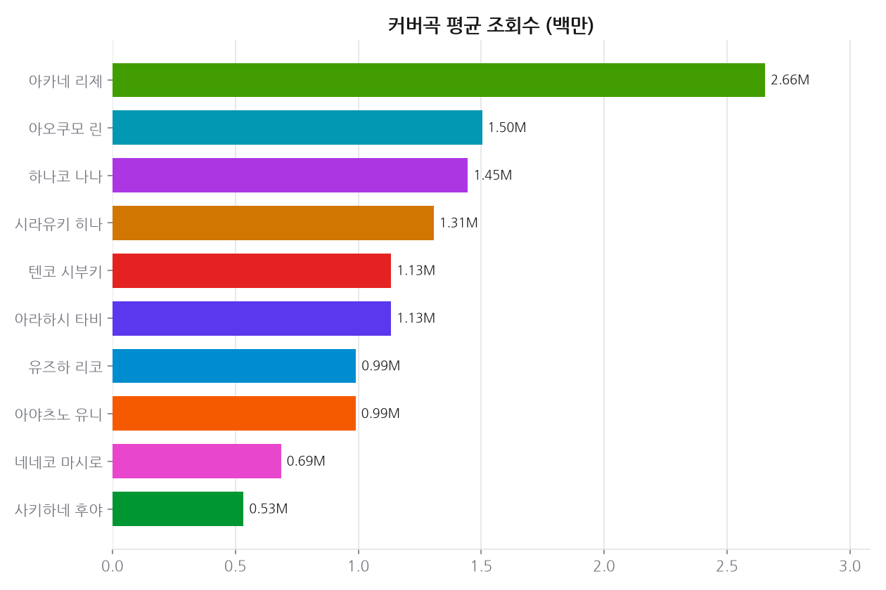
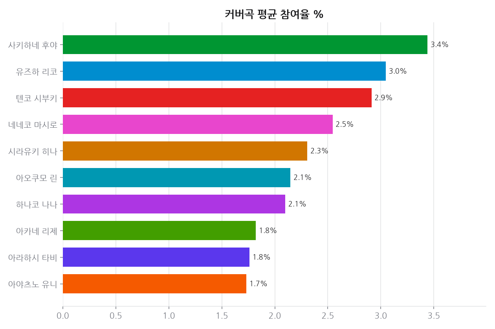
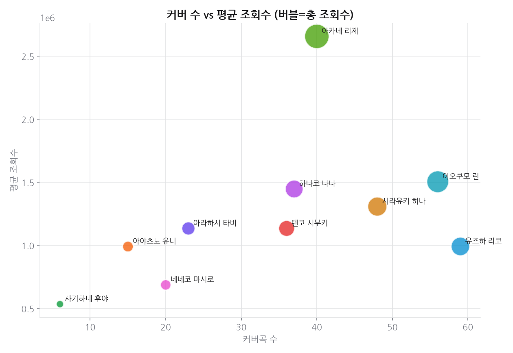
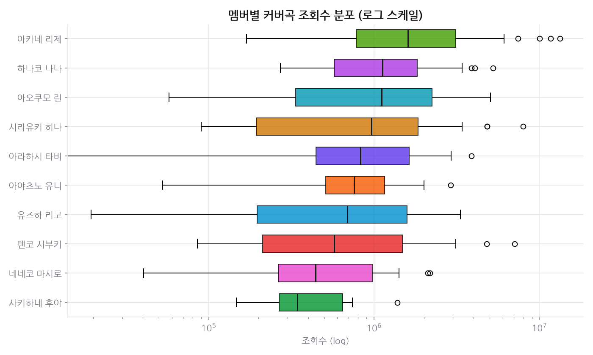

# 프로젝트 2 · 커버곡 성과 랭킹

**기준 2026-08-30**  · 날짜별 축적

## 결론

커버곡은 업로드 수와 성과가 비례하지 않는다. 최다 업로더와 총 조회수 1위가 다른 사람이고, 곡당 평균 조회수 1위는 업로드가 중간인 멤버다. 즉 커버곡에서는 **어떤 곡을 고르느냐가 몇 곡을 올리느냐보다 크게 작용한다.** 다만 프로젝트 1에서 업로드 빈도가 조회수를 견인한 것과는 방향이 달라, 콘텐츠 종류에 따라 물량 전략의 효과가 갈린다고 읽어야 한다.

---

## 데이터

- 데이터 소스: YouTube Data API v3 (채널 검색 + 영상 지표), 수집 2026-08-30
- 멤버 11명 · 커버곡 366개

## 한눈에

- **커버 총 조회수 1위**: 아카네 리제 — 106.2M (40곡)
- **최다 커버 업로드**: 유즈하 리코 — 59곡
- **곡당 평균 조회수 1위**: 아카네 리제 — 2.66M
- **역대 최고 조회 커버**: 아카네 리제 — 13.3M
  - 「출항 [抜錨(발묘) / 나나호시 관현악단 ナナホシ管弦楽団] ㅣ아카네 리제(Akane Lize) 【COVER】」

## 시간에 따른 변화

### 추세 · 커버 총 조회수

축적 18일 (기준 2026-08-30)

| 멤버 | 1일(1d) | 7일(7d) |
|---|---:|---:|
| 네네코 마시로 | +1.25% | +2.98% |
| 사키하네 후야 | +0.29% | +2.15% |
| 유즈하 리코 | +0.24% | +1.70% |
| 하나코 나나 | +0.23% | +1.58% |
| 아오쿠모 린 | +0.21% | +1.55% |
| 텐코 시부키 | +0.20% | +1.50% |
| 아라하시 타비 | +0.19% | +1.36% |
| 아카네 리제 | +0.19% | +1.46% |
| 시라유키 히나 | +0.13% | +0.95% |
| 아야츠노 유니 | +0.11% | +0.75% |

## 근거 자료

### 차트 7종 (최신 실행 2026-08-30 기준)

## 원자료

이 리포트를 만든 코드와 데이터는 저장소의 [`youtube_analyze_all/02_cover_song_ranking/`](../../youtube_analyze_all/02_cover_song_ranking/) 에 있다.

| 경로 | 내용 |
|---|---|
| `collect.py` | 수집 |
| `analyze.py` | 정제·집계·차트 생성 |
| `data/` | 원천·정제 데이터 (CSV/JSON) |
| `sql/` | 스키마·INSERT·분석쿼리·SQLite·쿼리 실행결과 |
| `site/index.html` | 자체완결 인터랙티브 대시보드 |
| `data/history.csv` | 날짜별 지표 축적 (이 리포트의 추세 절 근거) |
