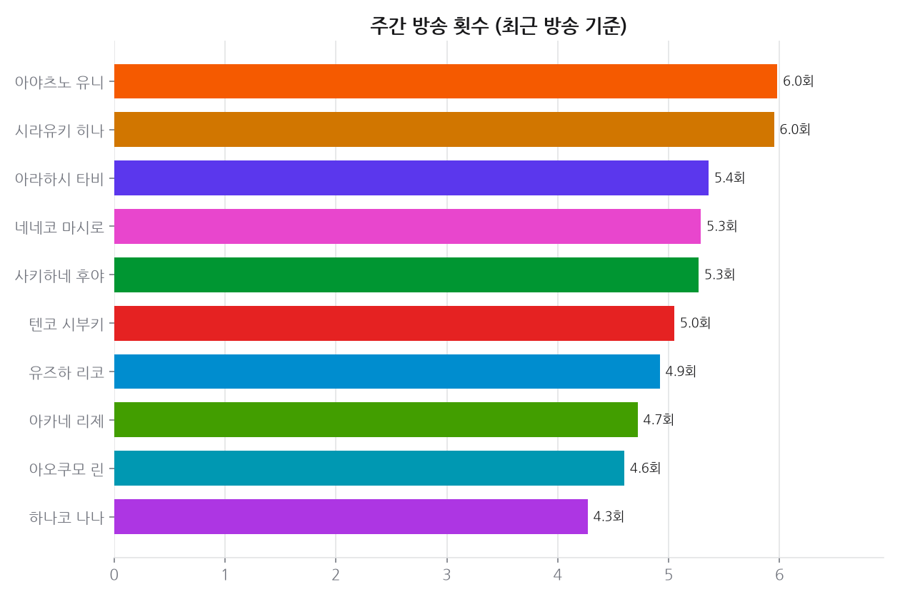
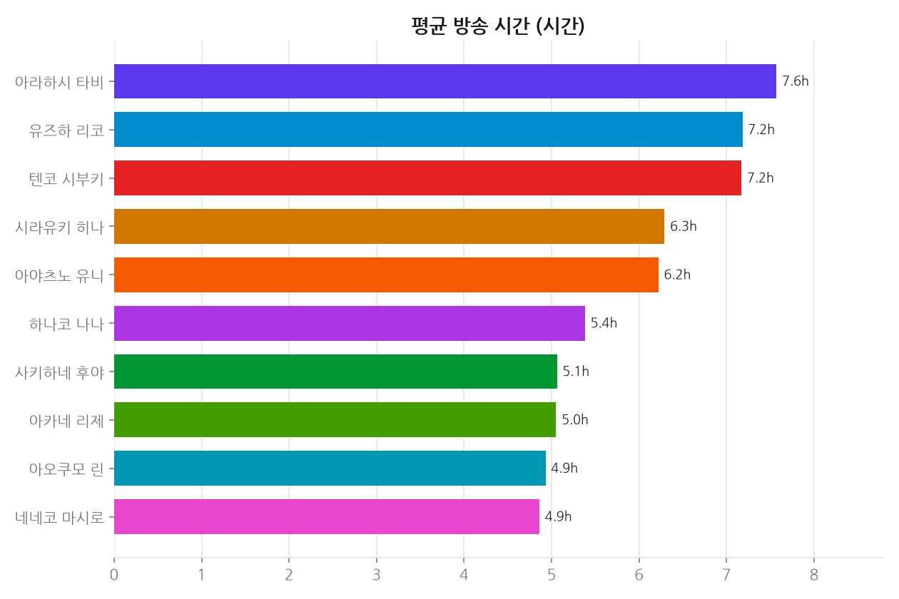
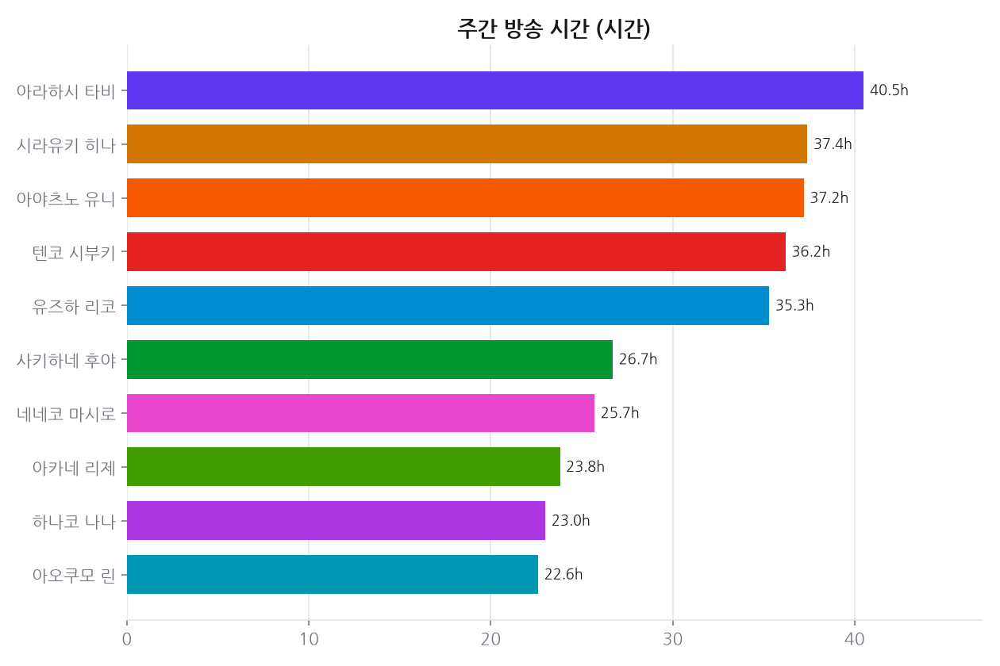
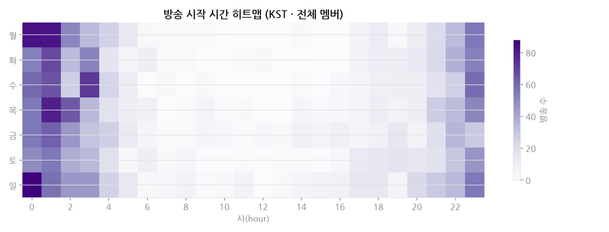
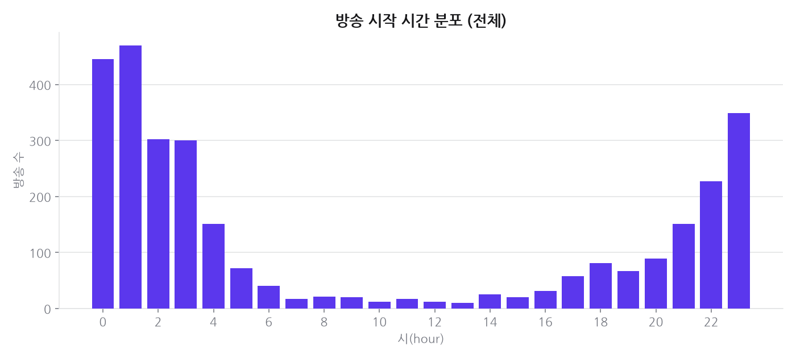
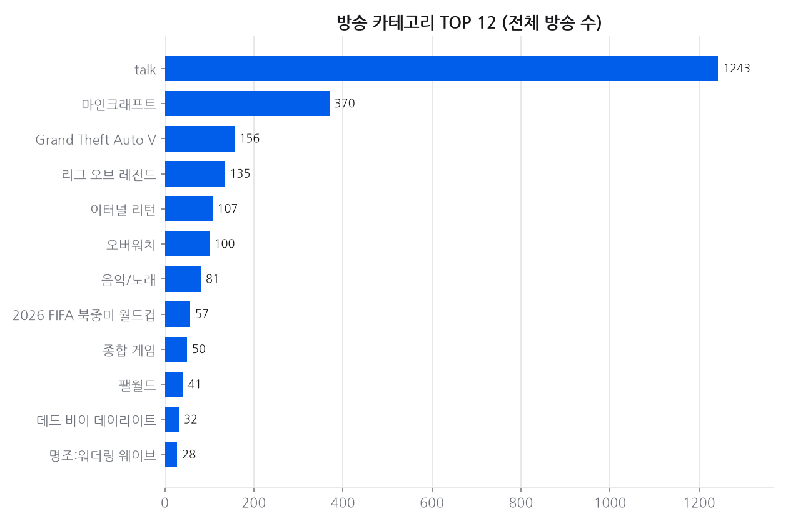
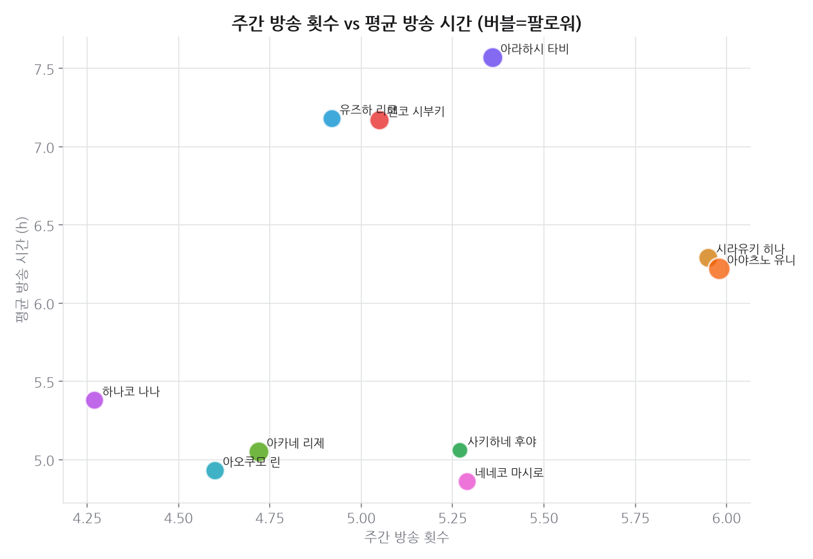
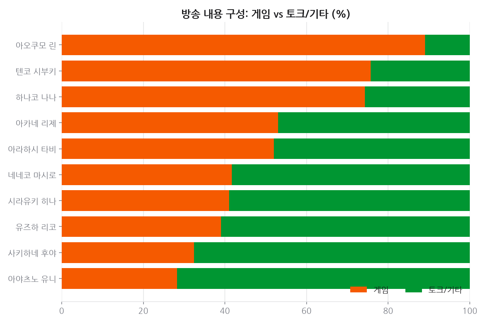

# 프로젝트 3 · 치지직 방송 패턴

**기준 2026-10-08**  · 날짜별 축적

## 결론

방송이 가장 많이 시작되는 시간대는 **새벽 1시(KST)** 다. 심야 편성이 예외가 아니라 기본값이고, 주간 방송 시간 1위와 방송 빈도 1위가 서로 다른 사람이라 '길게 적게' 와 '짧게 자주' 라는 두 전략이 공존한다. 게임 대 토크 비중도 멤버마다 갈려, 이 그룹에는 단일한 방송 공식이 없다.

---

## 데이터

- 데이터 소스: 치지직(Chzzk) 비공식 API — 다시보기(VOD replay) 3287건, 수집 2026-10-08
- 멤버 11명, 멤버당 최근 최대 300개 방송

## 한눈에

- **주간 방송 시간 1위**: 아라하시 타비 — 주 40시간
- **최장 평균 방송**: 아라하시 타비 — 회당 평균 7.6시간
- **최다 방송 빈도**: 아야츠노 유니 — 주 6.0회
- **최고 심야형(0~5시 시작)**: 텐코 시부키 — 81%
- 전체 방송이 가장 많이 시작되는 시간대: **1시** (KST)

## 시간에 따른 변화

### 추세 · 치지직 팔로워

축적 54일 (기준 2026-10-08)

| 멤버 | 1일(2d) | 7일(7d) | 28일(28d) |
|---|---:|---:|---:|
| 하나코 나나 | +0.14% | +0.55% | +2.53% |
| 아라하시 타비 | +0.08% | +0.35% | +1.68% |
| 사키하네 후야 | +0.05% | +0.35% | +2.20% |
| 아야츠노 유니 | +0.04% | +0.20% | +0.99% |
| 텐코 시부키 | +0.03% | +0.27% | +1.59% |
| 아카네 리제 | +0.03% | +0.34% | +1.98% |
| 아오쿠모 린 | +0.02% | +0.45% | +1.72% |
| 유즈하 리코 | +0.02% | +0.23% | +2.10% |
| 네네코 마시로 | +0.01% | +0.17% | +0.87% |
| 시라유키 히나 | -0.00% | +0.06% | +0.91% |

## 근거 자료

### 차트 8종 (최신 실행 2026-10-08 기준)

