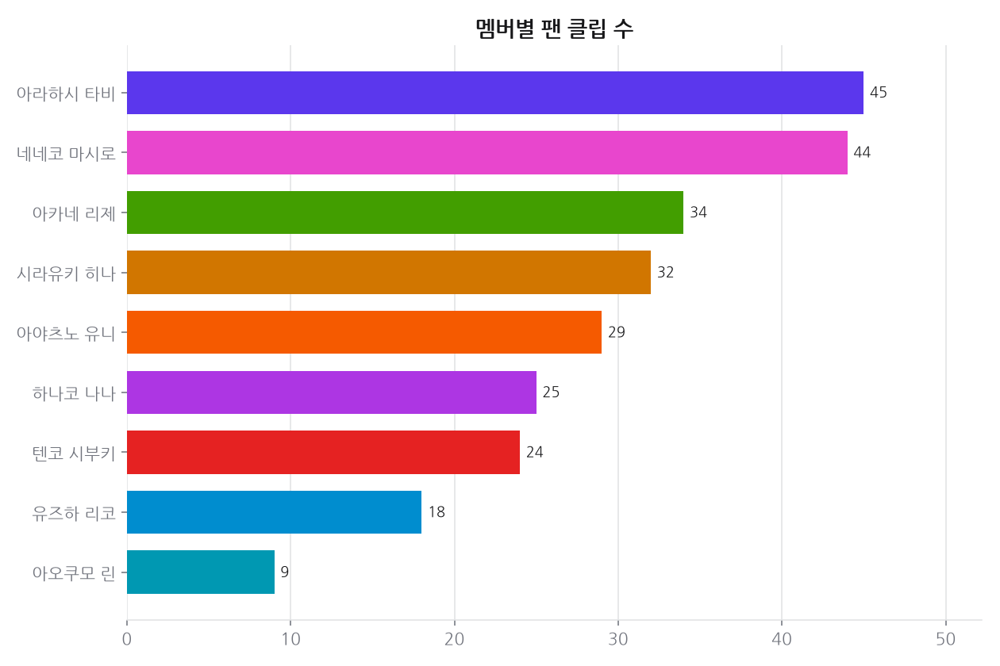
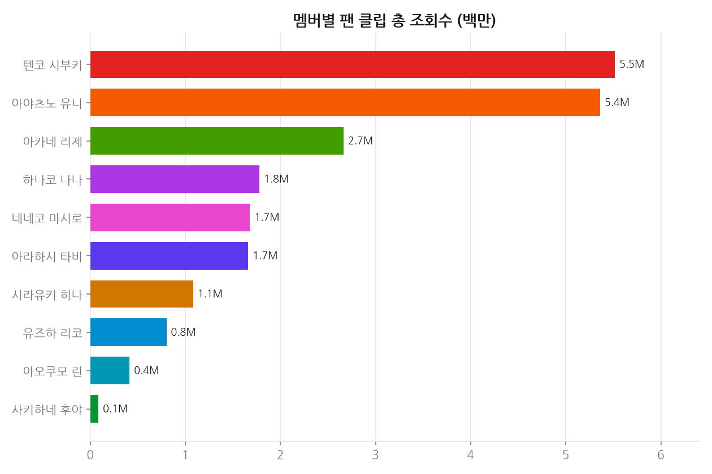
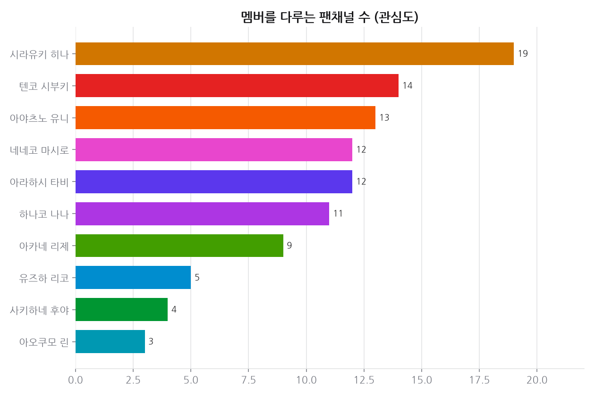
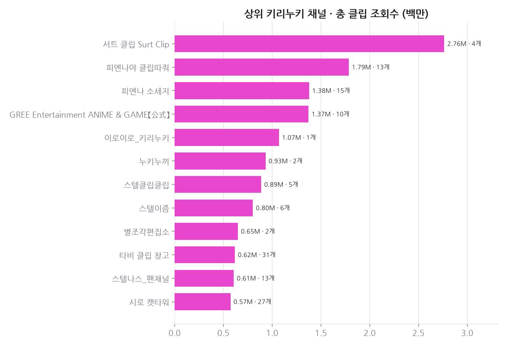
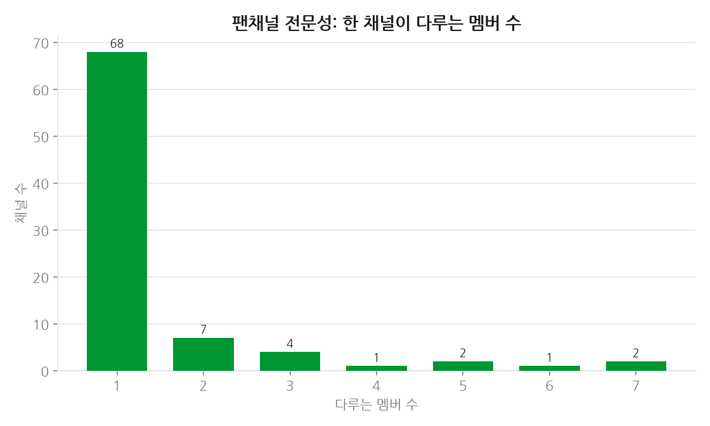
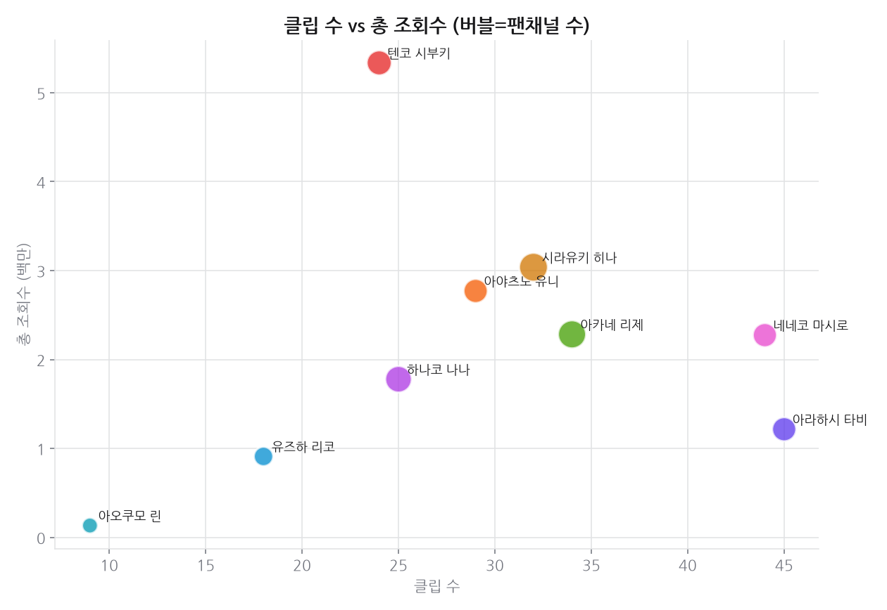

# 프로젝트 4 · 키리누키(2차창작) 생태계

**기준 2026-08-15**

## 결론

팬 제작 클립은 공식 채널 성과와 순위가 일치하지 않는다. 클립 총 조회수 1위와 가장 많은 팬채널이 다루는 멤버가 다르다 — 전자는 소수 대형 클립 채널의 선택에, 후자는 저변의 넓이에 좌우되기 때문이다. 표본 합계 조회수 20.4M 은 공식 채널 조회수에 비하면 작지만, **아무도 돈을 받지 않고 만든 것**이라는 점에서 팬덤 활성도의 직접 지표다.

---

## 데이터

- 데이터 소스: YouTube Data API v3 (멤버명+키리누키/클립/切り抜き 검색), 수집 2026-08-15
- 공식 채널 제외 후 팬 제작 클립만 집계: 클립 284개 · 팬채널 79개
- 필터: 제목/채널명 키리누키·클립 토큰

## 한눈에

- **팬 클립 총 조회수 1위**: 강지 — 5.0M (15개 클립)
- **가장 많은 팬채널이 다루는 멤버**: 네네코 마시로 — 17개 채널
- **최대 키리누키 채널**: 클립따는 유인원 — 총 3.3M (7개)
- 생태계 표본 합계 조회수: 22.7M

## 근거 자료

### 차트 6종 (최신 실행 2026-08-15 기준)

## 원자료

이 리포트를 만든 코드와 데이터는 저장소의 [`youtube_analyze_all/04_kirinuki_ecosystem/`](../../youtube_analyze_all/04_kirinuki_ecosystem/) 에 있다.

| 경로 | 내용 |
|---|---|
| `collect.py` | 수집 |
| `analyze.py` | 정제·집계·차트 생성 |
| `data/` | 원천·정제 데이터 (CSV/JSON) |
| `sql/` | 스키마·INSERT·분석쿼리·SQLite·쿼리 실행결과 |
| `site/index.html` | 자체완결 인터랙티브 대시보드 |
