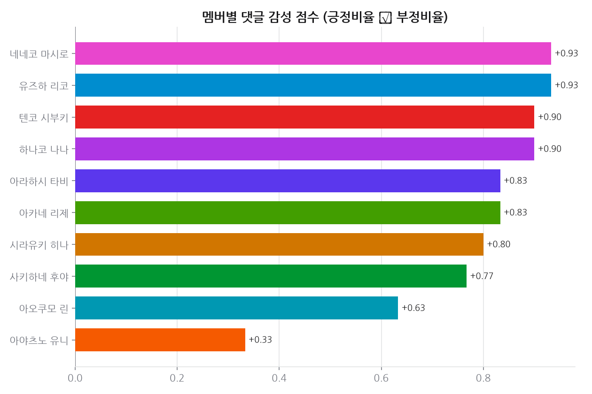
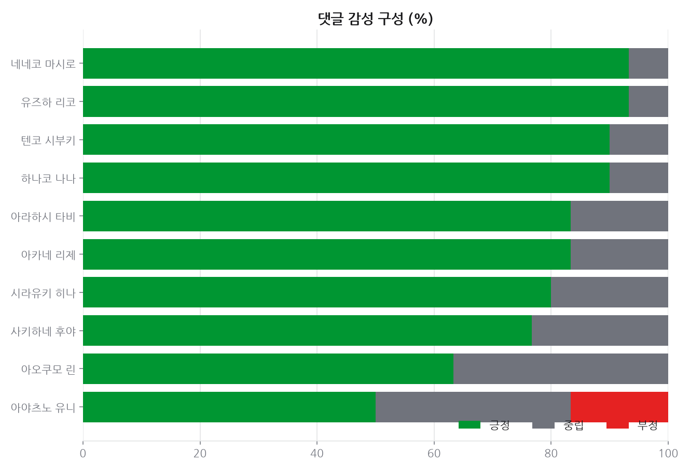
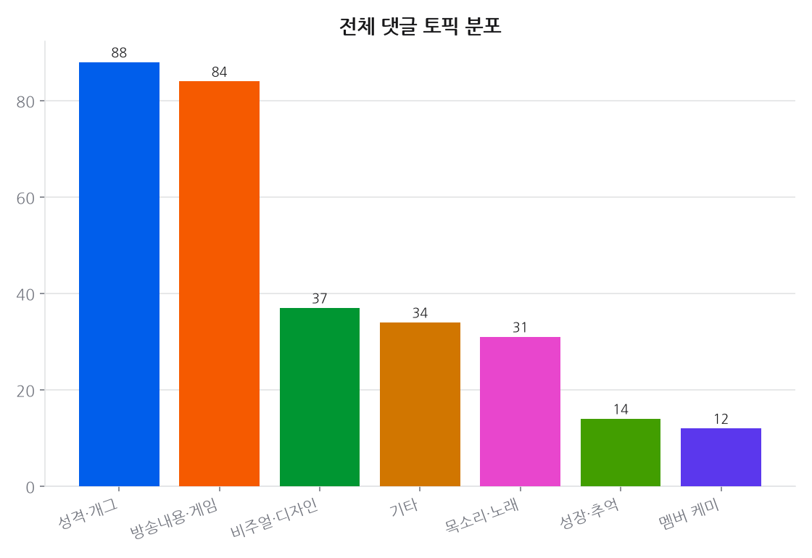
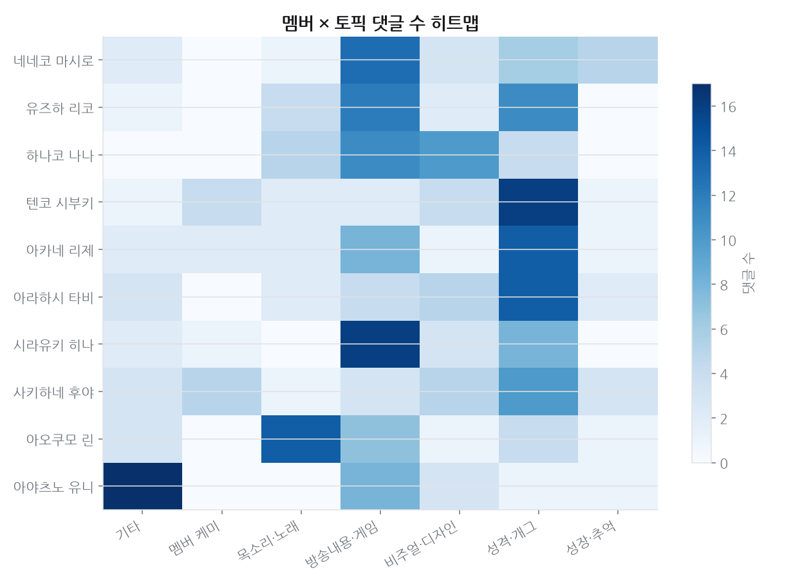

# 프로젝트 5 · 댓글 여론/감성

**기준 2026-08-15**

## 결론

상위 댓글의 **80% 가 긍정**이다. 다만 이건 '팬덤이 화목하다'가 아니라 **표본의 성격**으로 읽어야 한다. 유튜브 추천순 상위 댓글은 좋아요를 많이 받은 것들이고, 팬 커뮤니티에서 좋아요를 모으는 건 대체로 애정 표현이다. 부정 여론이 없다는 근거로는 쓸 수 없다. 토픽 분포에서는 성격·개그가 목소리·노래를 앞서, 팬들이 콘텐츠보다 **사람**에 반응한다.

---

## 데이터

- 데이터: 멤버별 인기 영상 44개의 상위(추천순) 댓글 1753개 중,
  좋아요 상위 330개 표본을 **Claude(본 세션)** 가 직접 읽고 감성(긍정/중립/부정)·토픽 7종으로 분류.
- 수집 2026-08-15

## 한눈에

- 표본 전체 긍정 비율 **80%** — 상위 댓글은 대부분 팬 애정 표현.
- **감성 점수 1위**: 네네코 마시로 (점수 +0.93)
- 가장 많이 언급되는 토픽: **성격·개그**
- 멤버×토픽 히트맵에서 목소리·노래, 성격·개그가 대다수 멤버의 상위 토픽으로 나타남.

## 상세 분석

### 방법론 & 한계

- 댓글은 유튜브 `order=relevance`(추천순) 상위 표본 — 실제 시청자에게 가장 잘 보이는 댓글이며,
  전체 댓글의 무작위 표본은 아님(추천 알고리즘이 긍정/재치있는 댓글을 우선 노출하는 경향 있음).
- 라벨링은 규칙 기반이 아닌 Claude의 문맥 판단(반어법·팬덤 용어 고려)으로 수행.

## 근거 자료

### 차트 4종 (최신 실행 2026-08-15 기준)

## 원자료

이 리포트를 만든 코드와 데이터는 저장소의 [`youtube_analyze_all/05_comment_sentiment/`](../../youtube_analyze_all/05_comment_sentiment/) 에 있다.

| 경로 | 내용 |
|---|---|
| `collect.py` | 수집 |
| `analyze.py` | 정제·집계·차트 생성 |
| `data/` | 원천·정제 데이터 (CSV/JSON) |
| `sql/` | 스키마·INSERT·분석쿼리·SQLite·쿼리 실행결과 |
| `site/index.html` | 자체완결 인터랙티브 대시보드 |
