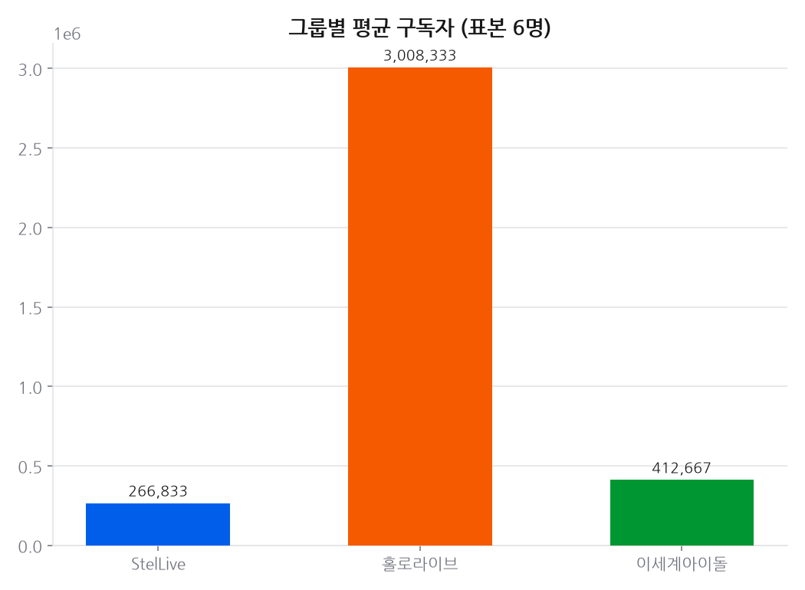
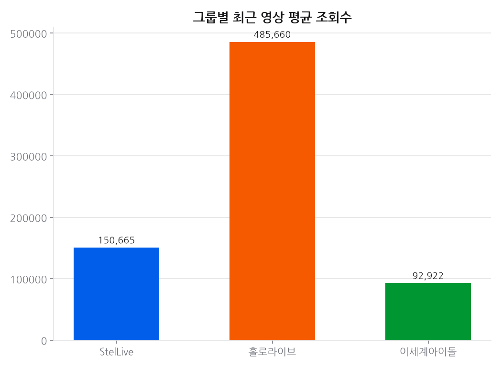
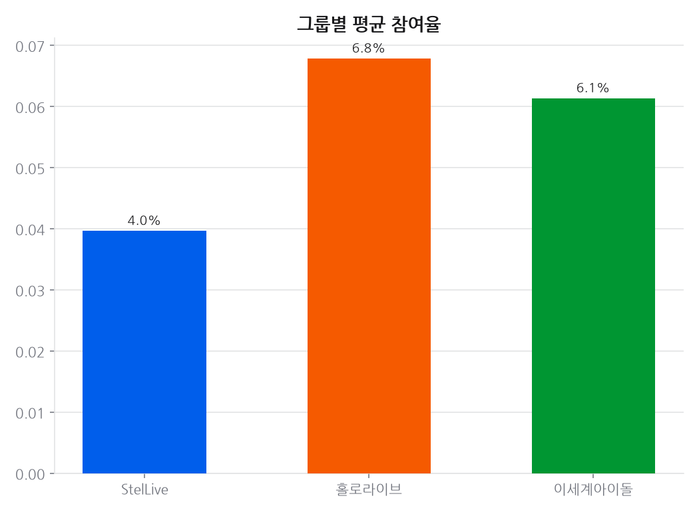
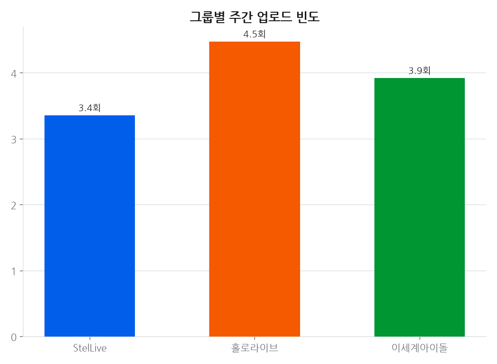
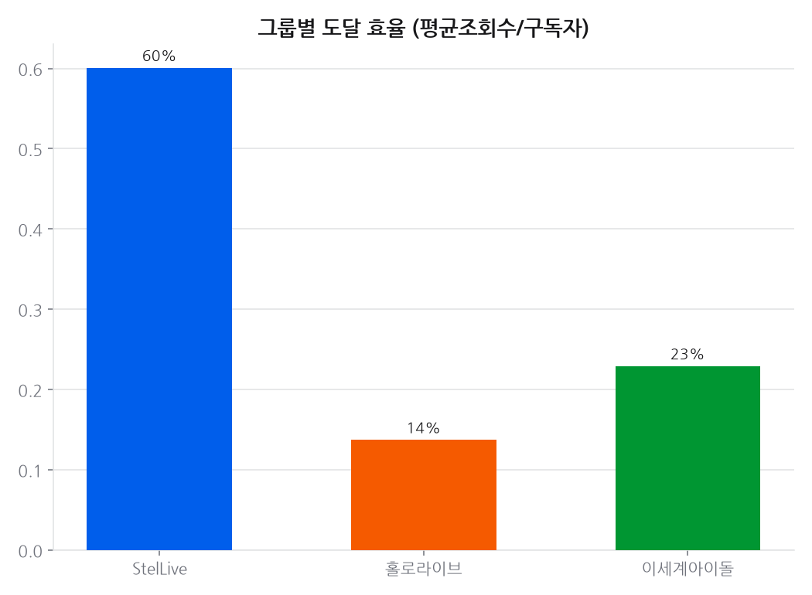
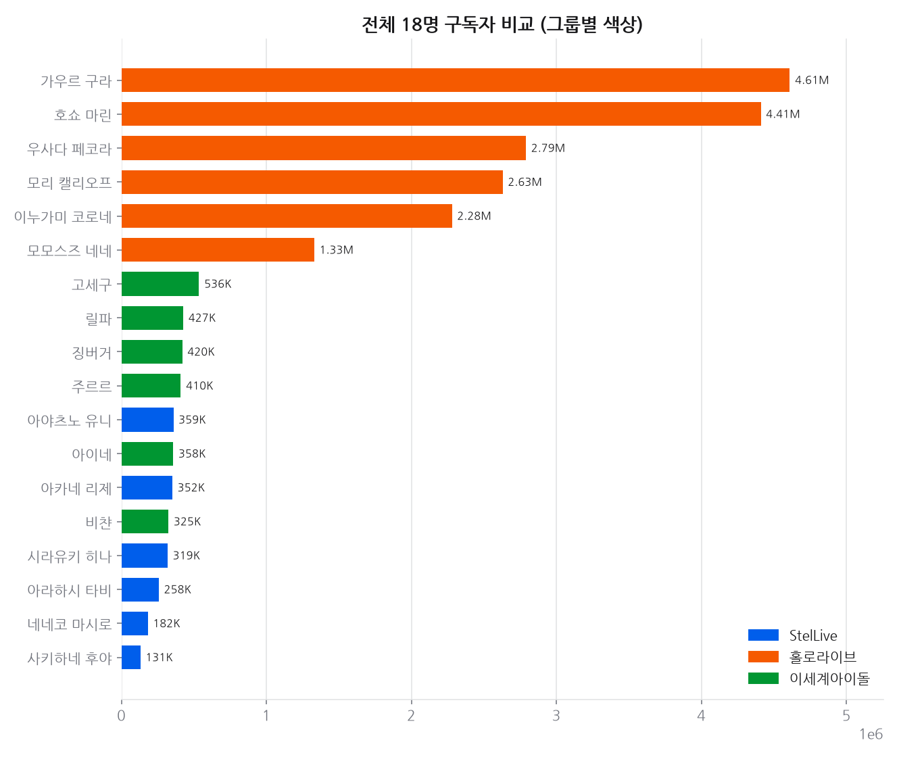
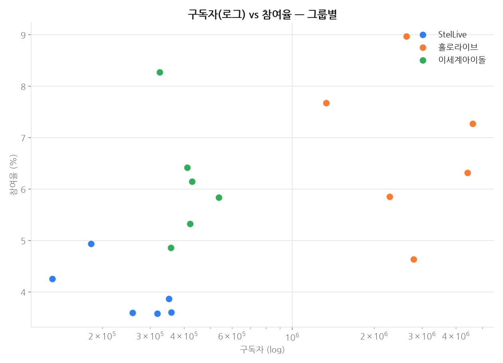

# 프로젝트 6 · 경쟁사 비교

**기준 2026-08-29**  · 날짜별 축적

## 결론

StelLive 는 규모에서 밀리지만 **도달 효율에서 압도한다.** 평균 구독자는 홀로라이브의 10분의 1 수준인데 도달 효율(평균조회수/구독자)은 **4배 이상** 앞선다. 구독자 수가 곧 영향력이 아니라는 뜻이고, 규모가 작을수록 구독자가 실제 시청으로 이어지는 비율이 높다는 프로젝트 1의 발견과 같은 방향이다.

---

## 데이터

- 각 그룹 대표 멤버 6명 표본, 채널당 최근 30개 영상. 수집 2026-08-29
- 홀로라이브: 우사다 페코라·가우르 구라·호쇼 마린·모리 캘리오프·모모스즈 네네·이누가미 코로네
- 이세계아이돌: 아이네·징버거·릴파·주르르·고세구·비챤

## 한눈에

| 지표 | StelLive | 홀로라이브 | 이세계아이돌 |
|------|---------:|----------:|-------------:|
| 평균 구독자 | 266,833 | 3,008,333 | 412,667 |
| 평균 최근 조회수 | 150,665 | 485,660 | 92,922 |
| 평균 참여율 | 4.0% | 6.8% | 6.1% |
| 주간 업로드 | 3.4회 | 4.5회 | 3.9회 |
| 도달 효율 | 60% | 14% | 23% |

- **규모**: 홀로라이브(글로벌) > 이세계아이돌(국내 대형) > StelLive 순 — 신생/중견 그룹 포지션.
- **참여율·도달 효율**은 규모가 작을수록 오히려 높게 나타나는 경향 — 충성도 높은 소규모 팬덤 구조.

## 시간에 따른 변화

### 추세 · 구독자

축적 17일 (기준 2026-08-29)

| 멤버 | 1일(1d) | 7일(7d) |
|---|---:|---:|
| 네네코 마시로 | +0.55% | +0.55% |
| 아카네 리제 | +0.28% | +0.57% |
| 가우르 구라 | +0.00% | +0.00% |
| 고세구 | +0.00% | +0.00% |
| 릴파 | +0.00% | +0.00% |
| 모리 캘리오프 | +0.00% | +0.00% |
| 모모스즈 네네 | +0.00% | +0.00% |
| 비챤 | +0.00% | +0.00% |
| 사키하네 후야 | +0.00% | +0.00% |
| 시라유키 히나 | +0.00% | -0.31% |
| 아라하시 타비 | +0.00% | +0.39% |
| 아야츠노 유니 | +0.00% | +0.00% |
| 아이네 | +0.00% | +0.00% |
| 우사다 페코라 | +0.00% | +0.00% |
| 이누가미 코로네 | +0.00% | +0.00% |
| 주르르 | +0.00% | -0.24% |
| 호쇼 마린 | +0.00% | +0.00% |
| 징버거 | -0.24% | -0.24% |

> 유튜브 구독자는 API 가 1,000 단위로 반올림해 준다. 작은 채널은 하루에 0 또는 +1,000 으로만 움직여 짧은 창에서는 `+0.00%` 로 찍힌다. 실제로 안 늘어난 것이 아니라 반올림 경계를 안 넘은 것이다 — 짧은 구간은 치지직 팔로워(정확한 정수)를 같이 보는 편이 낫다.

## 근거 자료

### 차트 7종 (최신 실행 2026-08-29 기준)

## 원자료

이 리포트를 만든 코드와 데이터는 저장소의 [`youtube_analyze_all/06_competitor_comparison/`](../../youtube_analyze_all/06_competitor_comparison/) 에 있다.

| 경로 | 내용 |
|---|---|
| `collect.py` | 수집 |
| `analyze.py` | 정제·집계·차트 생성 |
| `data/` | 원천·정제 데이터 (CSV/JSON) |
| `sql/` | 스키마·INSERT·분석쿼리·SQLite·쿼리 실행결과 |
| `site/index.html` | 자체완결 인터랙티브 대시보드 |
| `data/history.csv` | 날짜별 지표 축적 (이 리포트의 추세 절 근거) |
