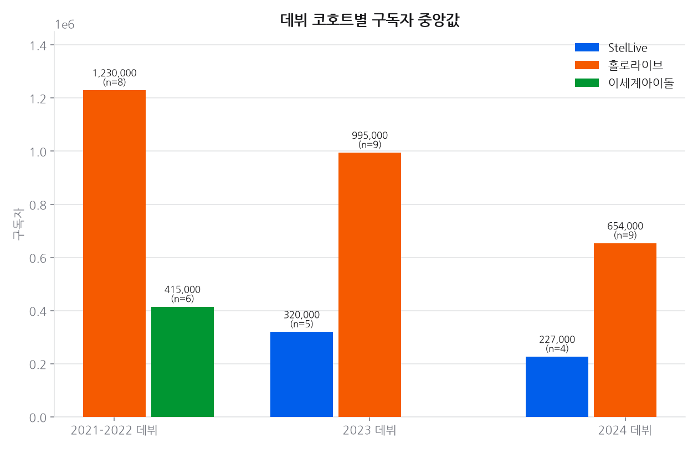
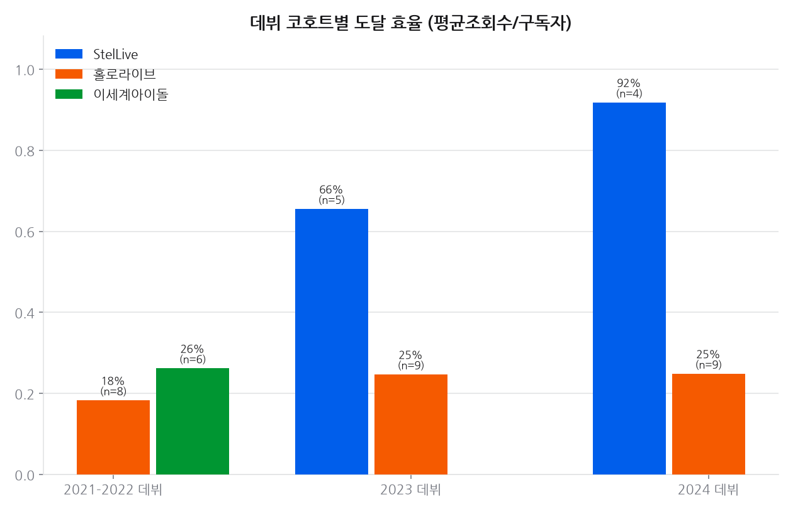
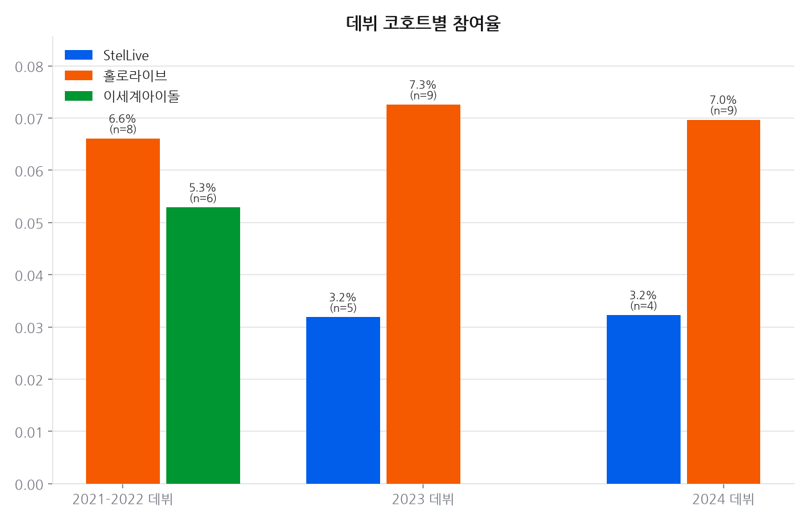
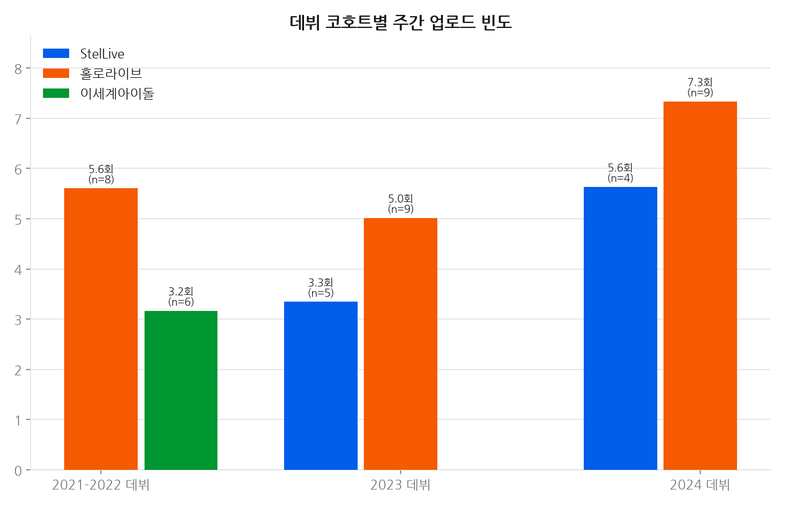
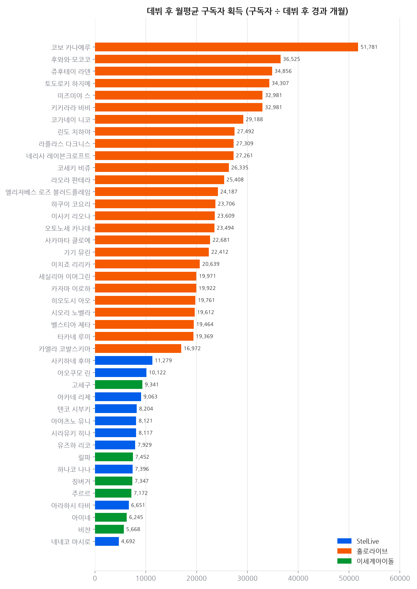
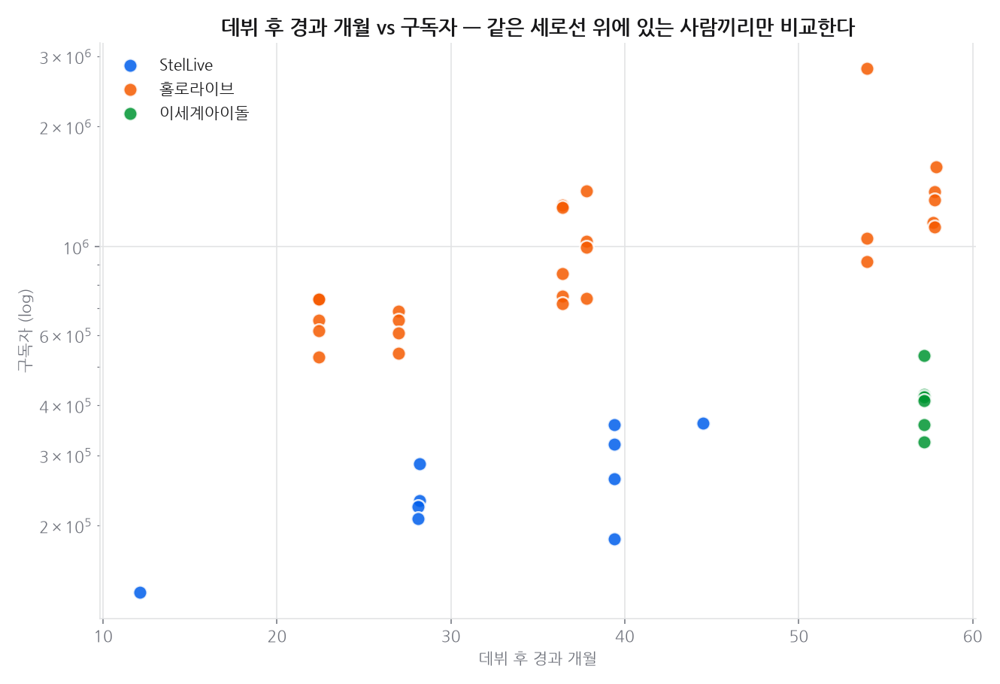

# 프로젝트 6 · 경쟁사 비교

**기준 2026-09-22**  · 날짜별 축적

## 결론

**규모 비교는 데뷔 시기를 맞춰야 성립한다.** 구독자는 매일 조금씩만 늘고 거의 줄지 않는 누적 지표라, 먼저 시작한 채널이 항상 앞서 있다. 예전 비교는 2019~2020년 데뷔한 홀로라이브 유명 멤버 6명과 2023~2025년 데뷔한 StelLive 멤버를 나란히 놓은 것이어서, '평균 구독자 10배 차이'는 대부분 **4~6년 먼저 시작했다는 사실을 다시 말한 것**에 가깝다. 표본을 **기수 전원**으로 바꾸고 비교를 같은 데뷔 코호트 안으로 제한하면, 남는 차이는 누적이 아닌 지표—도달 효율과 참여율—에서 드러난다. 이세계아이돌은 StelLive 보다 1년 반 먼저 데뷔해 같은 코호트가 아니므로, 같은 시기 데뷔한 홀로라이브 기수와 짝지어 따로 본다.

---

## 데이터

- 대상 42채널 · 채널당 최근 30개 영상. 수집 2026-09-22
- 표본은 **기수 전원**이다. 개인 인지도로 고르지 않는다 — 유명한 사람만 뽑으면 그 표본이 곧 생존편향이다.
- 그룹 비교는 **같은 코호트 안에서만** 한다. 구독자는 누적 지표라 데뷔 시기가 다르면 비교가 성립하지 않는다.

## 한눈에

### 2021-2022 데뷔

| 지표 | 홀로라이브 | 이세계아이돌 |
|------|---:|---:|
| 인원 | 8명 | 6명 |
| 데뷔 후 경과 | 56.3개월 | 57.2개월 |
| 구독자 중앙값 | 1,230,000 | 415,000 |
| 월평균 구독자 획득 | 21,302 | 7,260 |
| 최근 영상 평균 조회수 | 245,101 | 105,700 |
| 참여율 | 6.6% | 5.3% |
| 주간 업로드 | 5.6회 | 3.2회 |
| 도달 효율 | 18% | 26% |

홀로라이브: ID 3기·JP 6기 holoX  
이세계아이돌: 1기

### 2023 데뷔

| 지표 | StelLive | 홀로라이브 |
|------|---:|---:|
| 인원 | 5명 | 9명 |
| 데뷔 후 경과 | 40.4개월 | 37.0개월 |
| 구독자 중앙값 | 320,000 | 995,000 |
| 월평균 구독자 획득 | 8,117 | 26,335 |
| 최근 영상 평균 조회수 | 189,819 | 222,049 |
| 참여율 | 3.2% | 7.3% |
| 주간 업로드 | 3.3회 | 5.0회 |
| 도달 효율 | 66% | 25% |

StelLive: 1기 MYSTIC·2기 UNIVERSE  
홀로라이브: DEV_IS ReGLOSS·EN Advent

### 2024 데뷔

| 지표 | StelLive | 홀로라이브 |
|------|---:|---:|
| 인원 | 4명 | 9명 |
| 데뷔 후 경과 | 28.1개월 | 24.4개월 |
| 구독자 중앙값 | 227,000 | 654,000 |
| 월평균 구독자 획득 | 8,067 | 25,408 |
| 최근 영상 평균 조회수 | 210,744 | 157,756 |
| 참여율 | 3.2% | 7.0% |
| 주간 업로드 | 5.6회 | 7.3회 |
| 도달 효율 | 92% | 25% |

StelLive: 3기 CLICHE  
홀로라이브: DEV_IS FLOW GLOW·EN Justice

### 비교군 없는 코호트

다음 코호트는 같은 시기에 데뷔한 다른 그룹 표본이 없어 그룹 비교를 하지 않았다. 숫자는 멤버 표에만 남긴다.

- **2025 데뷔** — 사키하네 후야(StelLive, 12개월)

## 시간에 따른 변화

### 추세 · 구독자

축적 41일 (기준 2026-09-22)

| 멤버 | 1일(1d) | 7일(7d) | 28일(28d) |
|---|---:|---:|---:|
| 사키하네 후야 | +0.74% | +0.74% | +3.82% |
| 기기 뮤린 | +0.66% | +nan% | +nan% |
| 하나코 나나 | +0.48% | +nan% | +nan% |
| 아오쿠모 린 | +0.35% | +nan% | +nan% |
| 이사키 리오나 | +0.19% | +nan% | +nan% |
| 세실리아 이머그린 | +0.19% | +nan% | +nan% |
| 코가네이 니코 | +0.15% | +nan% | +nan% |
| 라오라 판테라 | +0.15% | +nan% | +nan% |
| 키키라라 비비 | +0.14% | +nan% | +nan% |
| 이치죠 리리카 | +0.13% | +nan% | +nan% |
| 고세구 | +0.00% | -0.19% | -0.37% |
| 네네코 마시로 | +0.00% | +0.54% | +2.21% |
| 네리사 레이븐크로프트 | +0.00% | +nan% | +nan% |
| 라플라스 다크니스 | +0.00% | +nan% | +nan% |
| 린도 치하야 | +0.00% | +nan% | +nan% |
| 릴파 | +0.00% | +0.00% | -0.23% |
| 미즈미야 스 | +0.00% | +nan% | +nan% |
| 벨스티아 제타 | +0.00% | +nan% | +nan% |
| 비챤 | +0.00% | +0.00% | -0.31% |
| 사카마타 클로에 | +0.00% | +nan% | +nan% |
| 시라유키 히나 | +0.00% | +0.00% | +0.31% |
| 시오리 노벨라 | +0.00% | +nan% | +nan% |
| 아라하시 타비 | +0.00% | +0.00% | +1.95% |
| 아야츠노 유니 | +0.00% | +0.00% | +0.56% |
| 아이네 | +0.00% | +0.00% | -0.28% |
| 아카네 리제 | +0.00% | +0.28% | +1.71% |
| 엘리자베스 로즈 블러드플레임 | +0.00% | +nan% | +nan% |
| 오토노세 카나데 | +0.00% | +nan% | +nan% |
| 유즈하 리코 | +0.00% | +nan% | +nan% |
| 주르르 | +0.00% | +0.00% | -0.24% |
| 쥬후테이 라덴 | +0.00% | +nan% | +nan% |
| 징버거 | +0.00% | +0.00% | -0.24% |
| 카엘라 코발스키아 | +0.00% | +nan% | +nan% |
| 카자마 이로하 | +0.00% | +nan% | +nan% |
| 코보 카나에루 | +0.00% | +nan% | +nan% |
| 코세키 비쥬 | +0.00% | +nan% | +nan% |
| 타카네 루이 | +0.00% | +nan% | +nan% |
| 텐코 시부키 | +0.00% | +nan% | +nan% |
| 토도로키 하지메 | +0.00% | +nan% | +nan% |
| 하쿠이 코요리 | +0.00% | +nan% | +nan% |
| 후와와·모코코 | +0.00% | +nan% | +nan% |
| 히오도시 아오 | -0.14% | +nan% | +nan% |

> 유튜브 구독자는 API 가 1,000 단위로 반올림해 준다. 작은 채널은 하루에 0 또는 +1,000 으로만 움직여 짧은 창에서는 `+0.00%` 로 찍힌다. 실제로 안 늘어난 것이 아니라 반올림 경계를 안 넘은 것이다 — 짧은 구간은 치지직 팔로워(정확한 정수)를 같이 보는 편이 낫다.

## 상세 분석

### 읽는 법

- **구독자 중앙값**: 같은 코호트 안에서만 비교한다. 코호트가 다르면 이 값의 차이는 대부분 활동 기간 차이다.
- **월평균 구독자 획득**: 구독자 ÷ 데뷔 후 경과 개월. 코호트가 달라도 속도는 견줄 수 있지만, 데뷔 직후 급증 구간이 포함되므로 신생 채널에 유리하게 치우친다. 보조 지표로만 쓴다.
- **도달 효율·참여율**: 누적이 아니라 최근 영상 기준이라 데뷔 시기 영향이 가장 적다. 코호트 간 비교에 그나마 가장 안전한 지표다.

> 표본 주의: 그룹 전체가 아니라 **선택된 기수 전원**이다. 홀로라이브는 StelLive·이세계아이돌과 데뷔 시기가 겹치는 기수만 넣었으므로, 여기 숫자를 홀로라이브 전체 평균으로 읽으면 안 된다.

## 근거 자료

### 차트 6종 (최신 실행 2026-09-22 기준)

