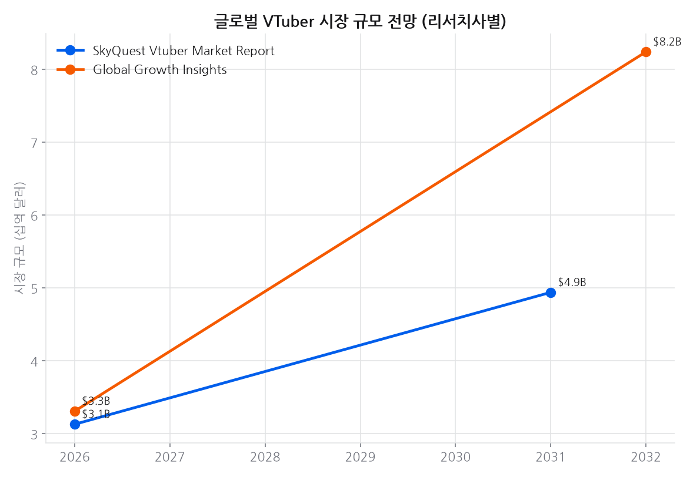
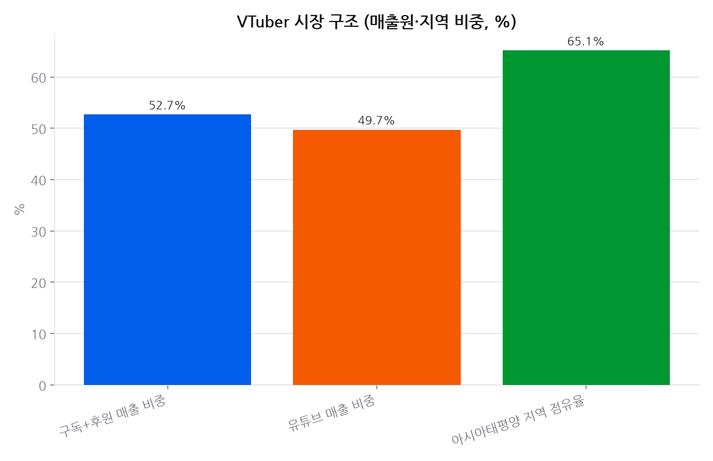
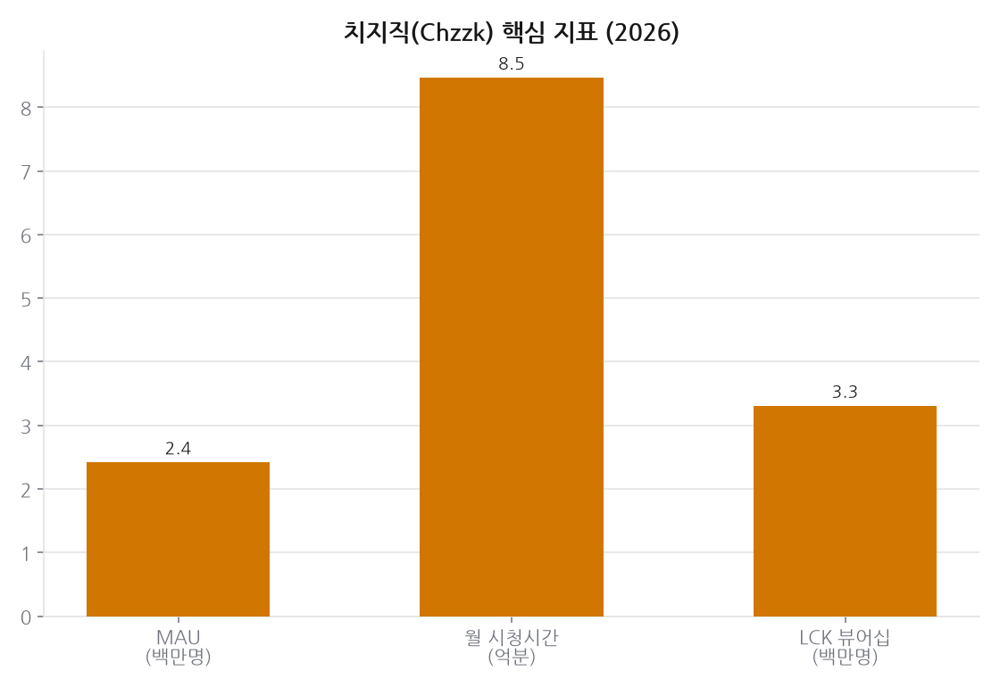
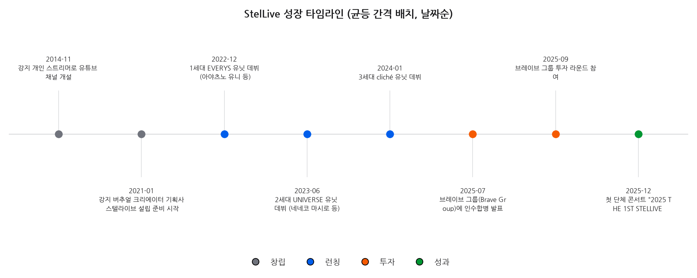
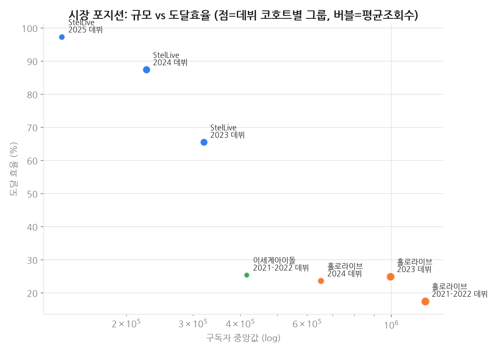

# 프로젝트 7 · 버추얼 크리에이터 시장

## 결론

VTuber 시장 추정치는 리서치사마다 2026년 31.3억~33.1억 달러로 갈리고 2032년 전망은 49.4억 대 82.4억 달러로 **1.7배 차이**가 난다. 단일 숫자로 인용하면 안 되고 범위로 이해해야 한다. 확실한 건 수익 구조로, 구독+후원이 **52.7%** 를 차지해 광고가 아니라 **직접 후원이 이 산업의 본체**다. 지역은 아시아태평양이 65.1% 로 편중돼 있다.

---

## 데이터

Claude 웹서치로 수집한 공개 시장 통계(출처 명시)와, 프로젝트1(멤버별 채널 성과)·
프로젝트6(경쟁사 비교)에서 이미 만든 자체 데이터를 결합한 종합 시장 리포트입니다.

## 상세 분석

### 글로벌 시장

- VTuber 시장 규모: **2026년 약 31.3억 달러** (SkyQuest), 2031년 49.4억 달러 전망(CAGR 9.56%).
  다른 리서치사(Global Growth Insights)는 2026년 33.1억 달러 → 2032년 82.4억 달러(CAGR 16.3%)로 추정 —
  리서치사별 편차가 커서 **범위로 이해**하는 것이 안전합니다.
- 매출 구조: 구독+후원(수퍼챗 등)이 **52.67%**, YouTube 플랫폼이 **49.73%** — 후원 기반 수익모델이 견고.
- 지역 편중: **아시아태평양이 65.14%** — 한중일 시장이 여전히 핵심 축.

### 한국 시장 (치지직 중심)

- 치지직 MAU **242만 명**(2026.7 기준, YoY +17%), 월 시청시간 **8.47억 분**(YoY +91%) — 트위치 철수 이후
  독주 체제 굳히는 중.
- e스포츠 중계권(EWC) 확보로 LCK 뷰어십 점유율 **60%+**, SOOP(구 아프리카TV) 대비 우위.
- 한국 크리에이터 산업 전체: 사업체 11,089개, 매출 5조 5,503억 원, 종사자 43,717명(2025, KMCC).

### StelLive의 시장 포지션

- 2025년 7월 **브레이브 그룹(Brave Group)에 인수합병** — 일본계 버추얼 기획사 자본 편입으로 해외 확장 발판.
- 2025년 12월 **첫 단체 콘서트** 개최로 오프라인 IP 확장 시작.
- 프로젝트6 자체 데이터 기준: 홀로라이브·이세계아이돌 대비 구독자 규모는 작지만
  **도달 효율(60%)이 압도적으로 높음** — "작지만 밀도 높은 팬덤"이 시장 내 차별화 포인트.

### 출처

- [SkyQuest Vtuber Market Report](https://www.skyquestt.com/report/vtuber-market)
- [Global Growth Insights](https://www.globalgrowthinsights.com/market-reports/vtuber-virtual-youtuber-market-102516)
- [파이낸셜뉴스](https://www.fnnews.com/news/202508171809456473)
- [한국콘텐츠진흥원(KMCC)](https://www.kmcc.go.kr/)

> 시장 규모 추정치는 리서치사별 방법론 차이로 편차가 크며, 특정 수치를 절대값이 아닌
> **성장 추세와 구조적 신호**로 해석하는 것을 권장합니다.

## 근거 자료

### 차트 5종

## 원자료

이 리포트를 만든 코드와 데이터는 저장소의 [`youtube_analyze_all/07_market_analysis/`](../../youtube_analyze_all/07_market_analysis/) 에 있다.

| 경로 | 내용 |
|---|---|
| `collect.py` | 수집 |
| `analyze.py` | 정제·집계·차트 생성 |
| `data/` | 원천·정제 데이터 (CSV/JSON) |
| `sql/` | 스키마·INSERT·분석쿼리·SQLite·쿼리 실행결과 |
| `site/index.html` | 자체완결 인터랙티브 대시보드 |
