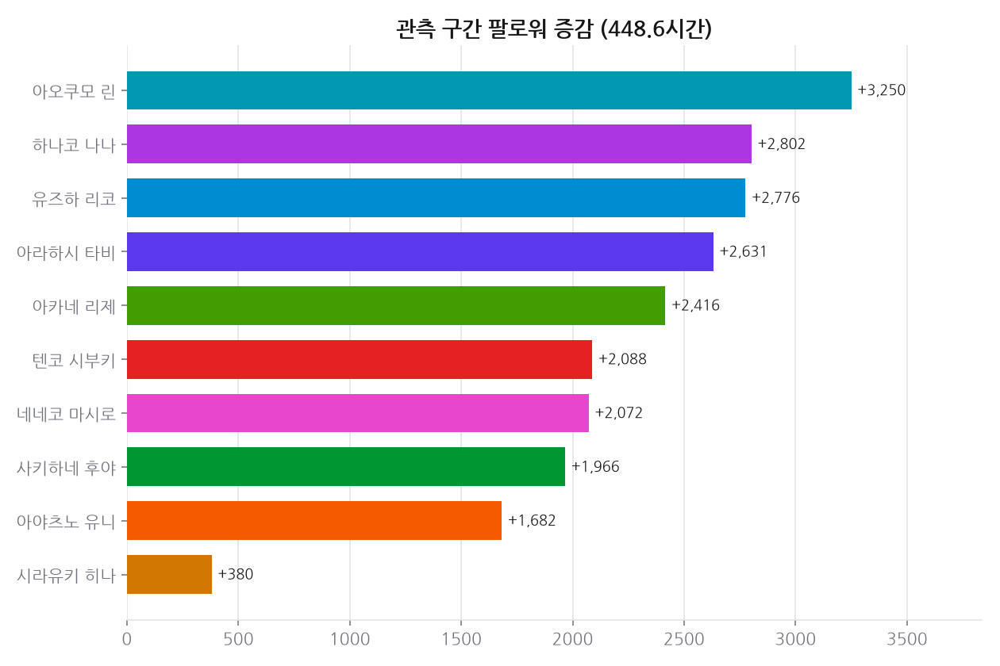
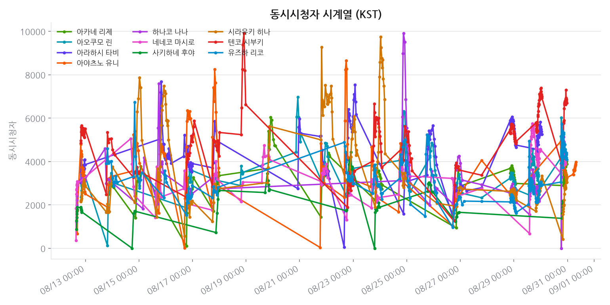
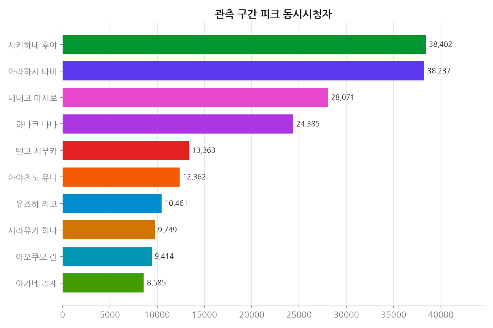
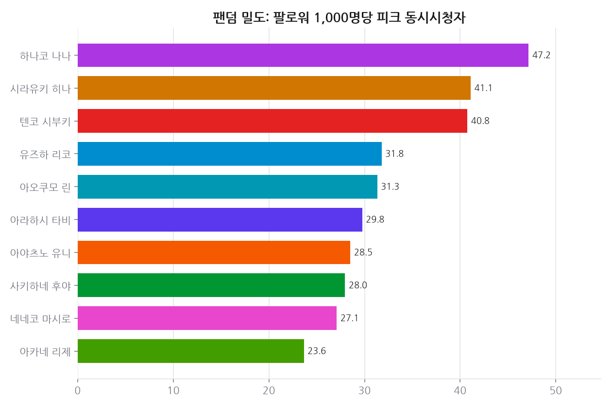

# 프로젝트 8 · 동시시청자 시계열

**기준 2026-08-12**  · 날짜별 축적

## 결론

이 포트폴리오에서 **유일하게 소급 수집이 불가능한** 지표다. 치지직은 동시시청자 히스토리 API 를 제공하지 않고 VOD 는 누적 조회수만 준다. 직접 찍어 쌓은 것만이 유일한 출처이며, 수집이 멈춘 구간은 영구 공백으로 남는다. 팬덤 밀도(팔로워 1,000명당 동시시청자)에서 순위가 구독자 순위와 크게 어긋나, 규모가 아니라 **밀도**가 따로 존재하는 지표임을 보여준다.

---

## 데이터

- 데이터 소스: 치지직 비공식 API (polling live-status) — 10분 간격 자체 수집
- 관측 구간: 2026-08-12T05:55 ~ 2026-08-30T22:32 (UTC), 약 448.6시간 / 스냅샷 729시점 · 7289건
- 멤버 10명

## 한눈에

- **관측 구간 팔로워 증가 1위**: 아오쿠모 린 — +3,250명 (일 환산 +174명)
- **피크 동시시청자 1위**: 하나코 나나 — 9,915명
- 관측된 방송 세션: 182건
- **팬덤 밀도 1위**: 하나코 나나 — 팔로워 1,000명당 47.2명 동시 시청

## 상세 분석

### 이 프로젝트가 따로 있는 이유

프로젝트3(방송 패턴)은 VOD 다시보기 목록으로 과거 방송 이력을 **소급 수집**할 수 있다.
하지만 동시시청자는 소급이 불가능하다. VOD는 누적 조회수(readCount)만 주고, 치지직에는
동시시청자 히스토리 API가 없다. 이 시계열은 직접 찍어 쌓은 것만이 유일한 출처다.

### 데이터 함정

치지직은 방송이 꺼져 있어도 `concurrentUserCount`에 직전 방송 값을 그대로 돌려준다.
`common.chzzk.normalize_live_status()`에서 `status`를 확인해 라이브 지표를 비우고,
잔존값은 `last_*`로 분리했다. 이 처리를 건너뛰면 오프라인 구간이 '시청자가 계속 있는
평지'로 찍혀 그래프가 통째로 거짓이 된다.

## 근거 자료

### 차트 4종 (최신 실행 2026-08-12 기준)

## 원자료

이 리포트를 만든 코드와 데이터는 저장소의 [`youtube_analyze_all/08_live_viewership/`](../../youtube_analyze_all/08_live_viewership/) 에 있다.

| 경로 | 내용 |
|---|---|
| `collect.py` | 수집 |
| `analyze.py` | 정제·집계·차트 생성 |
| `data/` | 원천·정제 데이터 (CSV/JSON) |
| `sql/` | 스키마·INSERT·분석쿼리·SQLite·쿼리 실행결과 |
| `site/index.html` | 자체완결 인터랙티브 대시보드 |
| `data/history.csv` | 날짜별 지표 축적 (이 리포트의 추세 절 근거) |
