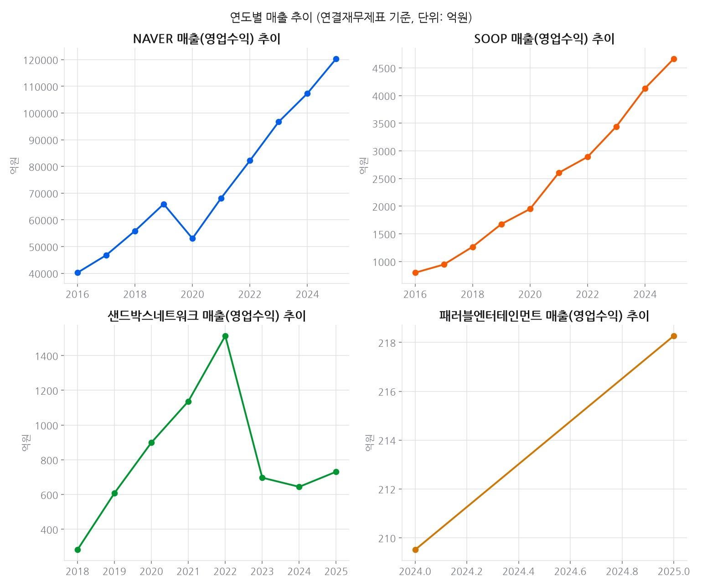
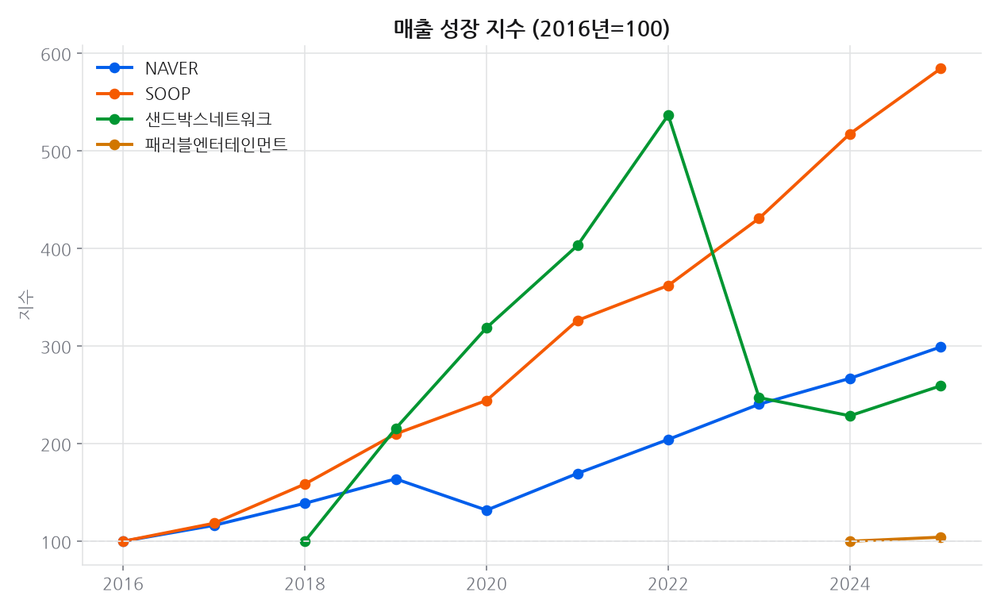
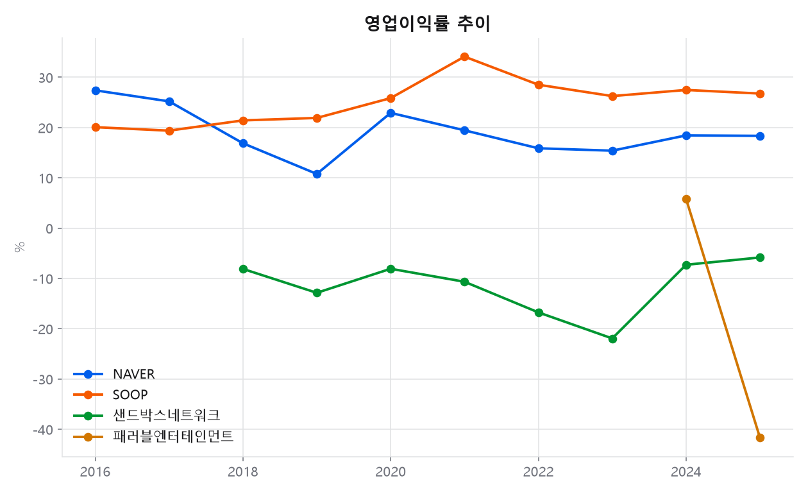
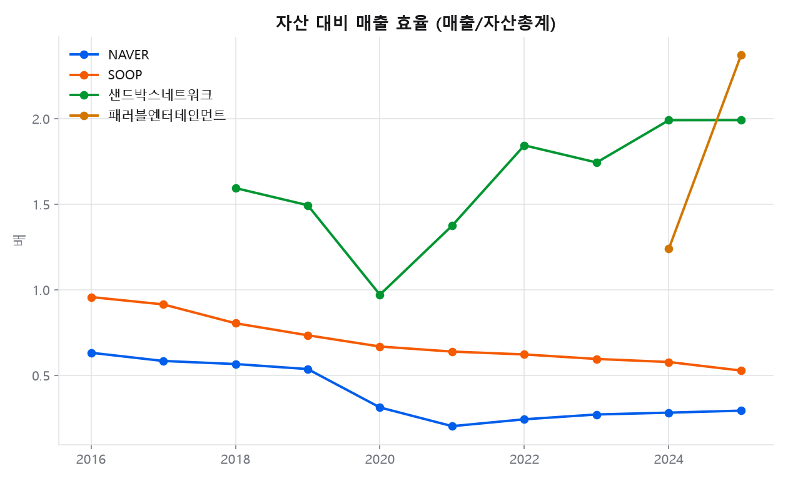
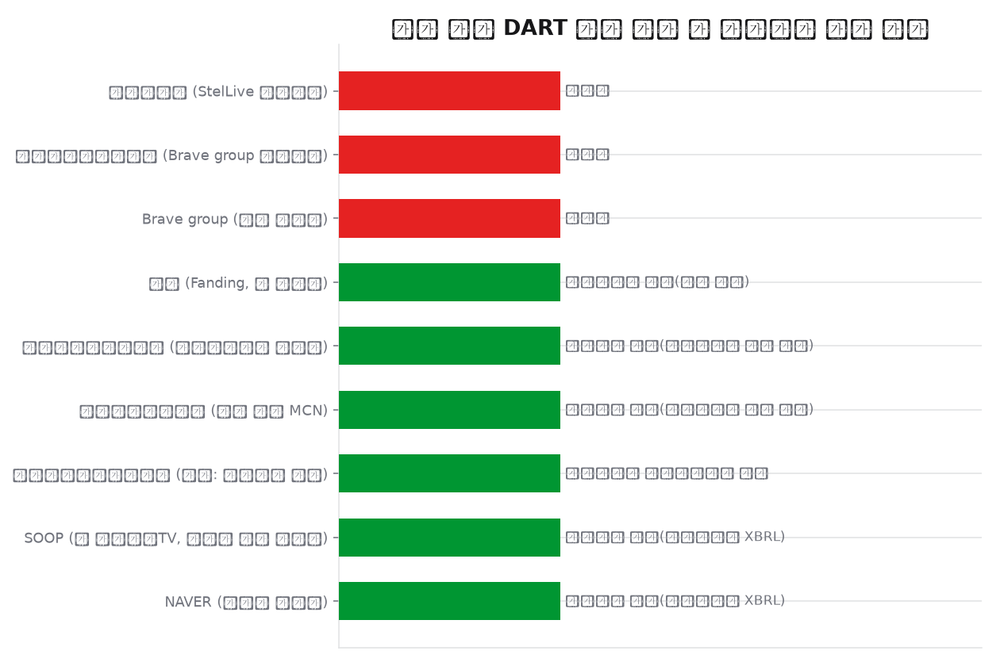

# 프로젝트 9 · DART 재무 분석

**기준 2026-08-13**

## 결론

**핵심 발견은 부재다.** 스텔라이브 운영법인이 DART 기업코드 마스터에 없다 — 비상장·소규모라 외부감사 대상이 아니거나 국내 법인이 아닐 수 있다. 즉 팬덤 지표로는 활발한 이 회사의 재무를 **공적 자료로는 검증할 수 없다.** 대신 확보한 동종업계 4곳에서 드러난 건 적자 구조로, 샌드박스네트워크는 2018년 이후 8년 내리 영업적자이고 패러블엔터테인먼트의 FY2025 영업이익은 -91억원이다. 팬덤 규모와 회사 수익성은 별개 문제다.

---

## 데이터

- 데이터 소스: Open DART(전자공시시스템) Open API — `corpCode.xml`, `company.json`, `list.json`, `fnlttSinglAcntAll.json`(정기보고서 XBRL), `document.xml`(감사보고서 원문)
- 수집 시각: 2026-08-13T02:31:41 UTC · 조사 대상 9곳 · 기업코드 확인 6곳 · **구조화된 재무제표 확보 4곳**

## 상세 분석

### 이 프로젝트가 다른 이유

01~06·08은 조회수·구독자·동시시청자 같은 **인기 프록시**를 측정한다. 09는 포트폴리오에서
유일하게 **감사받은 법정 공시 데이터**(재무제표)를 다룬다. 처음에는 XBRL 경로
(`fnlttSinglAcntAll`)로 NAVER·SOOP 2곳만 확보했지만, 이후 **감사보고서 원문
(`document.xml`)을 직접 파싱하는 두 번째 경로**를 추가해 샌드박스네트워크·
패러블엔터테인먼트까지 확보했다 — 자세한 내용은 아래 '감사보고서 원문 파싱' 절 참고.

### 무엇을 찾지 못했는가 (핵심 발견)

- **스텔라이브 (StelLive 운영법인)** — DART 기업코드 마스터에 없음(비상장·소규모 외부감사 미제출 또는 국내 미등록 가능)
- **브레이브그룹코리아 (Brave group 한국법인)** — DART 기업코드 마스터에 없음(비상장·소규모 외부감사 미제출 또는 국내 미등록 가능)
- **Brave group (일본 모기업)** — DART 기업코드 마스터에 없음(비상장·소규모 외부감사 미제출 또는 국내 미등록 가능)

기업코드는 확인되지만 **감사보고서를 포함해 DART에 낸 공시가 단 한 건도 없는** 법인:
- **팬딩 (Fanding, 팬 커머스)** (팬딩, 01921913) — `list.json`을 `pblntf_ty` 제한 없이·1999년부터 전체 기간으로 조회해도 0건. 감사보고서 경로를 추가한 뒤에도 마찬가지다(`data/filings.csv` 참고).

아래 법인은 분석에서 의도적으로 제외했다(재무 수치가 없어서가 아니다):
- **브레이브엔터테인먼트 (참고: 동명이인 주의)** (브레이브엔터테인먼트, 01605556) — 감사보고서 원문 파싱은 정상적으로 됐다(재무 수치 확보). 다만 이 법인은 K-pop 걸그룹 '브레이브걸스' 소속사이고, 이 프로젝트가 다루는 VTuber Brave group과는 이름만 같은 별개 법인이다 — 혼동을 막기 위해 결과 통합·차트·리포트에서 계속 제외한다.

**왜 XBRL 경로만으로는 부족한가.** `fnlttSinglAcntAll.json`은 XBRL이 태깅된 **정기보고서**
(사업보고서·반기보고서·분기보고서)만 파싱한다. 이건 사실상 상장사 + 일부 대형 비상장사의
몫이다. 샌드박스네트워크·패러블엔터테인먼트·팬딩·브레이브엔터테인먼트는 「외부감사법」에
따라 **감사보고서**만 금융감독원에 제출하면 되고, 이 감사보고서는 이 API가 파싱하는
XBRL 재무제표 세트에 포함되지 않는다 — 그래서 corp_code가 있어도 013(데이터 없음)이
정상 결과로 나온다. 이 한계 자체는 여전히 유효한 발견이다.

스텔라이브(주식회사 스텔라이브, 2023.4 설립) 자체와 Brave group(일본 모기업) 한국법인은
기업코드 마스터(118,701개 법인)에서조차 검색되지 않았다 — 아직 DART에 어떤 보고서도
낸 적이 없다는 뜻이다(외부감사 대상 요건 미달 또는 감사보고서 제출 이전 시점일 가능성).
감사보고서 경로를 추가해도 애초에 없는 필링을 만들어낼 수는 없으므로 이 결론은 그대로다.

### 감사보고서 원문 파싱: 013을 넘어서다

`fnlttSinglAcntAll`이 013을 반환하는 법인도 실제로는 `list.json`을 `pblntf_ty=F`
(외부감사관련)로 조회하면 감사보고서/연결감사보고서 이력이 나온다. 그 공시의
`rcept_no`로 `document.xml`을 요청하면 ZIP이 오는데, 압축을 풀면 DART 자체 DTD
(`dart3.xsd`/`dart4.xsd`)로 작성된 XML이 나온다 — XBRL이 아니라 DART의 전자공시 뷰어가
직접 렌더링하는 원본 서식이다. 실제로 확인한 구조:

- 별도재무제표(OFS): `<TITLE>재 무 상 태 표</TITLE>` 같은 제목 태그 뒤에 표준
  계정코드(`ACODE`, 예: 자산총계=`11500000010000`, 매출액=`12100000010000`)가 붙은
  `<TE>` 셀로 이루어진 표.
- 연결재무제표(CFS): `<TITLE>` 태그 없이 일반 `<TD>` 셀 + "과목/주석/당기/전기" 헤더만
  있는 표 — ACODE가 없어 계정과목 **텍스트**("자산총계", "영업수익" 등)로 매칭해야 한다.
- 오래된 필링(2019~2021년경)은 XML 선언에 `encoding="utf-8"`이라고 적혀 있어도 실제
  바이트는 EUC-KR인 경우가 있었다 — 선언을 믿지 않고 utf-8 → euc-kr 순으로 디코딩
  시도해서 처리했다.
- "영업이익(손실)"처럼 이익/손실을 한 라벨에 합쳐 괄호로 부호를 표시하는 경우와,
  "영업손실"처럼 별도 라벨로 나오되 값 자체는 부호 없는 양수(손실 크기)로 찍히는
  경우가 **같은 회사, 다른 연도**에 둘 다 나타났다 — 손실 전용 라벨은 항상 음수로
  강제(`-abs`)해서 통일했다.

**단위 검증.** 재무상태표·손익계산서 본표는 표 제목 옆에 `(단위 : 원)`이 명시돼 있고,
실제로 모든 표본에서 원(KRW) 단위였다. 반면 뒤쪽 **주석(Notes)** 표는 종종
`(단위: 천원)`을 쓴다 — 주석까지 잘못 읽으면 1,000배 오차가 난다. 이를 피하려고
각 재무제표 제목 뒤에 나오는 **첫 번째** 데이터 표만 쓰고 이후 표는 보지 않는다.

**교차검증 (실제로 수행한 방법).** 인접 연도의 감사보고서는 당기·전기 비교치를 함께
싣는다. 예를 들어 샌드박스네트워크 연결재무제표 기준 2024년 자산총계는 '연결감사보고서 (2024.12)' 파일의 **당기**란과 '연결감사보고서 (2025.12)' 파일의
**전기**란에 각각 독립적으로 인쇄돼 있는데, 파싱 결과 두 값이 정확히
32,389,420,968원으로 일치했다(원문 XML을 직접 열어 `(87,891,190,875)` 같은
괄호-음수 표기까지 육안으로 대조). 10개 필링에 걸쳐 이런 당기/전기 값이 어긋난
사례는 없었다.

- **샌드박스네트워크** (2018~2025년, 연결 우선): 2025년 매출 731.5억원, 영업이익 -42.7억원, 당기순이익 -45.1억원, 자산총계 367.4억원 (자본총계 -878.9억원 — 자본잠식)
- **패러블엔터테인먼트** (2024~2025년, 별도 우선): 2025년 매출 218.3억원, 영업이익 -91.0억원, 당기순이익 -91.9억원, 자산총계 92.1억원

**팬딩(Fanding)은 이 경로로도 데이터가 없다.** `list.json`을 `pblntf_ty` 제한 없이 전체 기간(1999~현재)으로 조회해도 팬딩(`01921913`)의 공시 이력은 0건이다 — `company.json`으로 법인 자체는 확인되지만(2018.9 설립, 대표 엄세현), 감사보고서를 포함해 DART에 어떤 보고서도 제출한 적이 없다. **프로젝트 11(팬 커머스)이 이 프로젝트의 DART 데이터로 팬딩의 매출·손익을 확인할 수는 없다** — 이 결론은 XBRL 경로에서도, 감사보고서 경로에서도 동일하다.

인건비 비중은 여전히 산출하지 못했다: 두 경로 모두 재무제표 본표(재무상태표·손익계산서·
현금흐름표·자본변동표)에는 인건비가 별도 계정으로 없다(기능별 표시 손익계산서라
'영업비용' 한 줄로 뭉쳐 있음). 인건비는 감사보고서 **주석**에만 나오는데, 주석 표는
단위가 '천원'으로 바뀌는 경우가 많고 표 구조도 회사·연도마다 제각각이라 이번 파싱
범위에서 의도적으로 제외했다 — 억지로 추정치를 만들지 않고 '산출 불가'로 남긴다.

### 확보한 데이터로 본 것 (연결재무제표 우선)

- **2025년 매출**: NAVER 120,350억원 vs SOOP 4,666억원 (약 26배 규모차)
- **영업이익률**: NAVER 18.3% vs SOOP 26.8%
- **자산 대비 매출 효율**: NAVER 0.29배 vs SOOP 0.53배
- **2016~2025년 매출 CAGR**: NAVER 12.9%/년 vs SOOP 21.7%/년
- **샌드박스네트워크**: 2025년 매출 731억원, 영업이익률 -5.8% — 2024~2025년 연결기준 자본총계가 음수(완전자본잠식)로 전환됐다(우선주 관련 부채 재분류 등 회계상 사유 가능성, 이 데이터만으로는 원인을 특정할 수 없다).
- **패러블엔터테인먼트**: 2025년 매출 218억원으로 전년(210억원) 대비 소폭 증가했지만 영업이익은 -91억원 적자로 전환됐다(전년 흑자 12억원).

### 팬덤 지표와 나란히 놓아보면

- 프로젝트1(2026-08 스냅샷): 스텔라이브 11명 합산 구독자 3,277,000명
- 프로젝트8(2026-08 스냅샷): 관측 142.4시간, 팔로워 증감 합계 +10,739명

**상관관계는 계산하지 않았다.** ① 스텔라이브 자체의 재무제표가 없어 '팬덤 지표 ↔ 자사
재무'라는 원래 질문 자체가 이 데이터로는 답이 안 나온다(패러블엔터테인먼트는 이세계아이돌
소속사이지만 스텔라이브와는 다른 법인이다). ② NAVER·SOOP는 플랫폼 전체 실적이라
스텔라이브라는 개별 크리에이터 그룹의 기여분을 분리할 수 없다. ③ 재무제표는 회계연도
단위이고 팬덤 지표는 2026-08 시점 스냅샷이라 기간도 어긋난다. 숫자 몇 개로 인과관계를
만드는 대신, 이 세 가지 이유를 그대로 남기는 쪽을 택했다.

## 근거 자료

### 차트 5종 (최신 실행 2026-08-13 기준)

## 원자료

이 리포트를 만든 코드와 데이터는 저장소의 [`youtube_analyze_all/09_dart_financials/`](../../youtube_analyze_all/09_dart_financials/) 에 있다.

| 경로 | 내용 |
|---|---|
| `collect.py` | 수집 |
| `analyze.py` | 정제·집계·차트 생성 |
| `data/` | 원천·정제 데이터 (CSV/JSON) |
| `sql/` | 스키마·INSERT·분석쿼리·SQLite·쿼리 실행결과 |
| `site/index.html` | 자체완결 인터랙티브 대시보드 |
