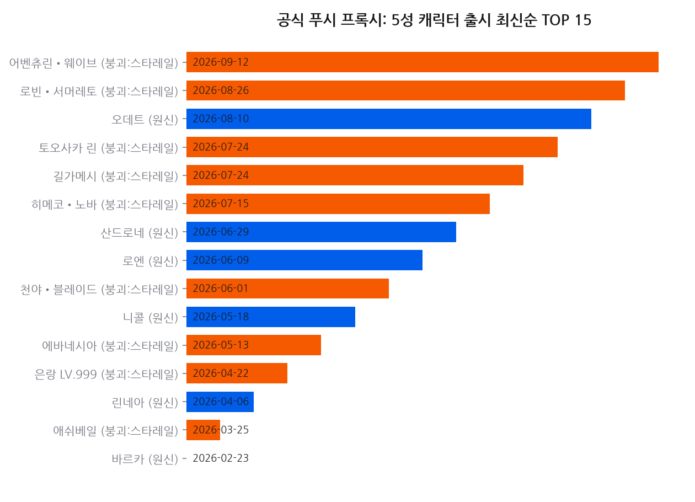
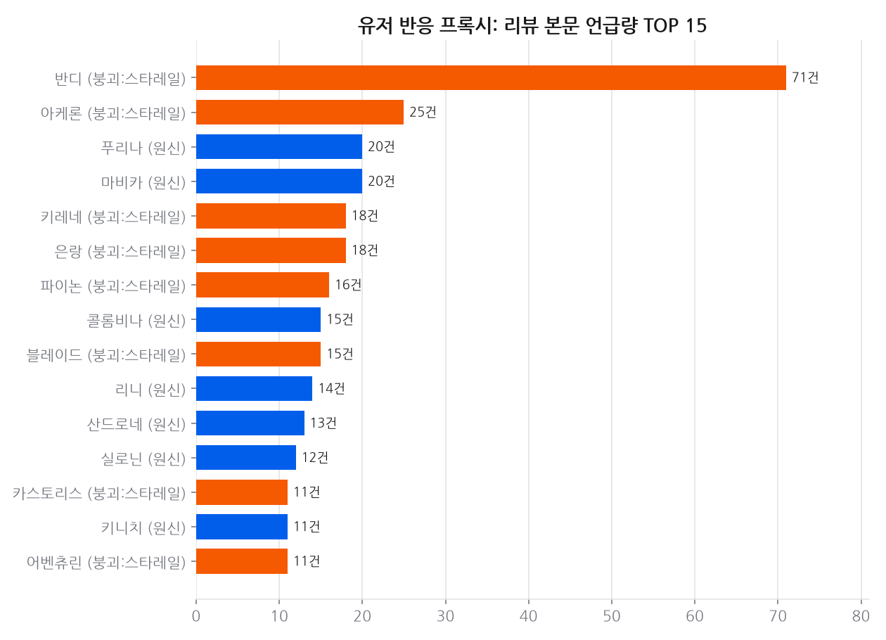
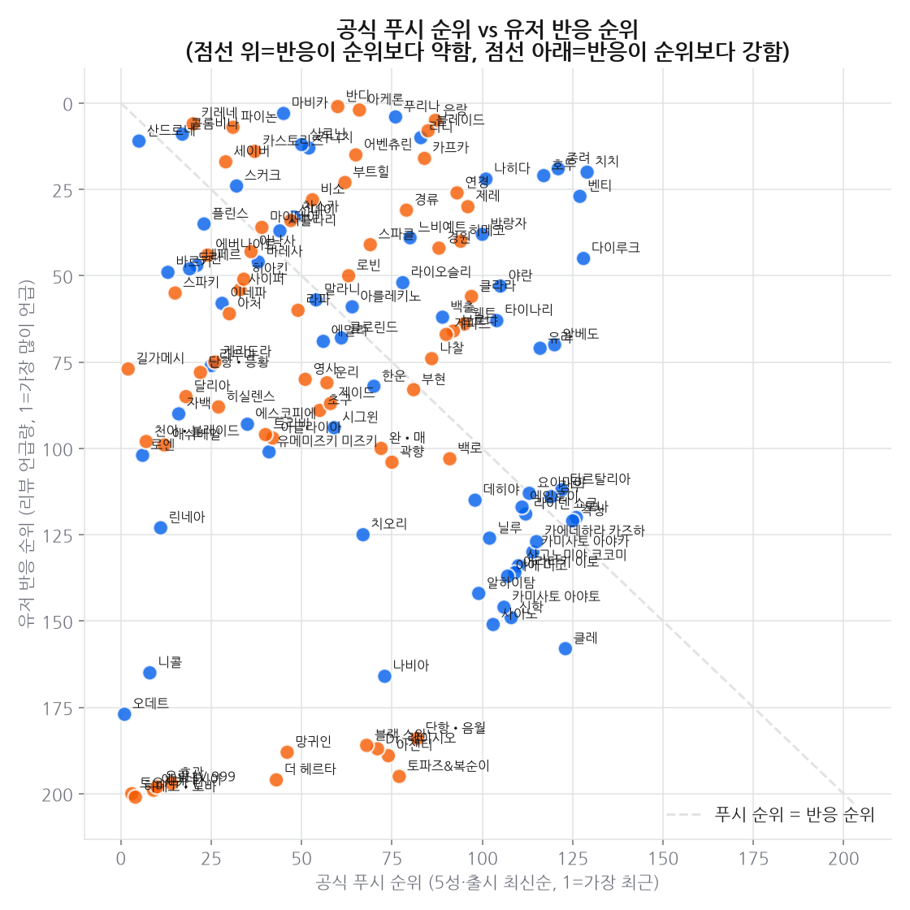
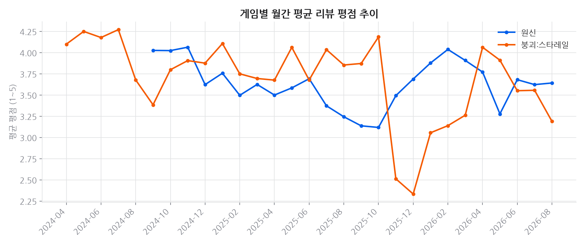
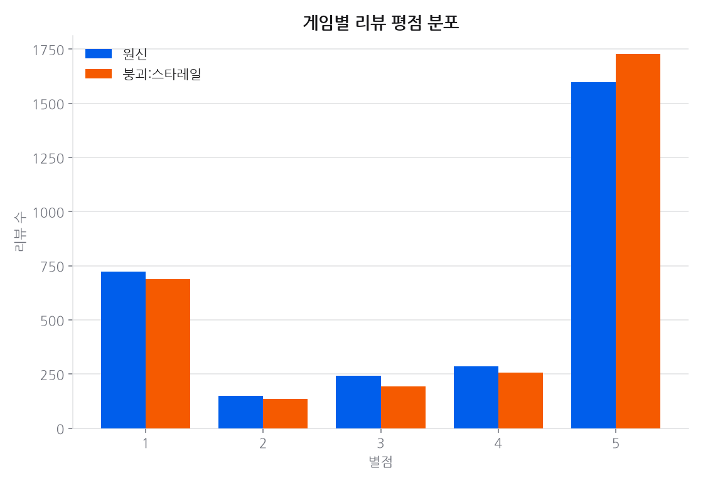
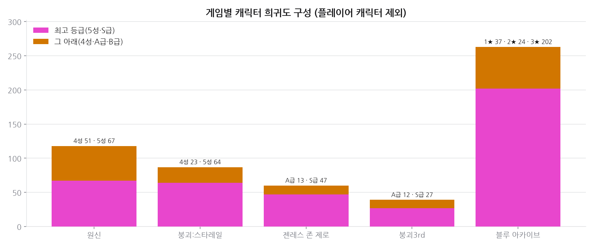
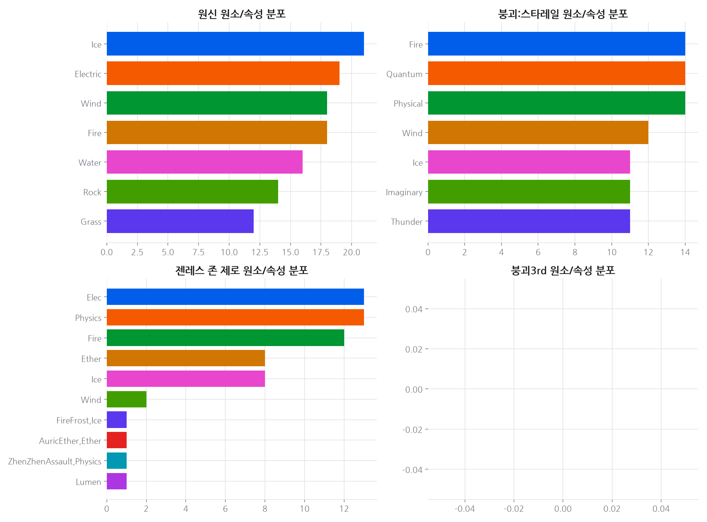
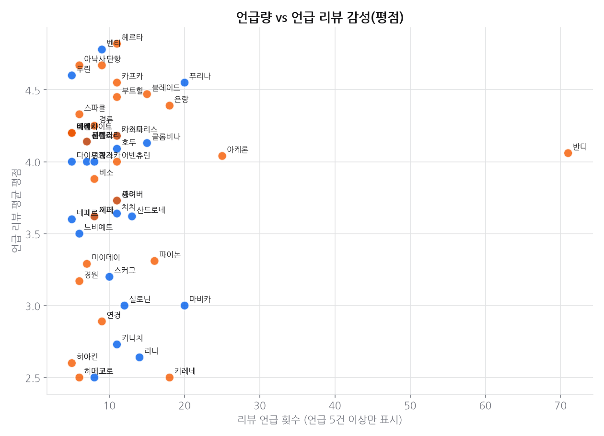

# 프로젝트 10 · 호요버스 캐릭터 인기도

**기준 2026-08-22**

## 결론

게임사가 미는 캐릭터와 유저가 반응하는 캐릭터가 **다르다.** 공식 푸시 1위(최신 5성)와 리뷰 언급량 1위가 일치하지 않는다. 다만 매칭 가능한 캐릭터의 **3분의 1 이상**이 수집된 리뷰에 한 번도 언급되지 않아, 언급량은 '인기'가 아니라 **'화제성'** 의 근사치로만 읽어야 한다. Google Trends 는 매 호출 429 로 실패해 설계에서 드롭했고, 그 실패도 데이터로 기록했다.

---

## 데이터

**질문**: 게임사가 밀어주는 캐릭터와 유저가 실제로 반응하는 캐릭터는 일치하는가?

- 데이터 소스: yatta.moe(Project Amber 후신, 캐릭터 마스터) + Google Play 리뷰
  (원신·붕괴:스타레일, 게임당 최근 리뷰 최대 3,000건)
- 수집 2026-08-22 · 캐릭터 203명(가챠 대상 203명,
  여행자/개척자 26명 제외) · 리뷰 6,000건
- **Google Trends는 이 환경에서 사용 불가** — 매 시도 즉시 429(요청 제한). 검색 관심도는
  아예 다루지 않았고, 대신 리뷰 본문 언급량으로 유저 반응을 근사했다(README 참고).

## 한눈에

- **공식 푸시 1위**(5성·최신 출시): 오데트(원신, 2026-08-10 출시)
- **유저 반응 1위**(리뷰 언급량): 반디(붕괴:스타레일, 71건 언급)
- 매칭 가능한 캐릭터(이름 2글자 이상) 201명 중 **73명은 수집된 리뷰
  표본에서 단 한 번도 언급되지 않았다** — 표본 리뷰가 게임당 3,000건에
  불과해 대부분의 캐릭터는 리뷰에 이름이 오르내릴 만큼 화제가 되지 않는다는 뜻이다.
- 언급량 자체가 대부분의 캐릭터에서 매우 희소하다(상위 몇 명에 쏠림). **가장 최근에 나온
  캐릭터와 리뷰에서 가장 많이 언급된 캐릭터는 상당 부분 일치하지 않는다** — TOP 15 교집합은
  아래 산점도(`03_push_vs_audience_rank.png`)에서 대각선(순위 일치선)을 얼마나 벗어나는지로 확인 가능.
- **주의**: 관측 데이터라 "배너를 자주 돌려서 언급량이 늘었다"는 인과 해석은 하지 않는다.
  언급량은 리뷰 작성 시점의 여러 이유(신캐 출시, 밸런스 논란, 버그 등)가 섞인 결과다.

## 상세 분석

### 데이터 함정

1. **배너/재출시 이력 데이터가 없다.** 무료·키 불필요 소스 중 배너 스케줄 API를 찾지
   못해(수집 단계 주석 참고), "공식 푸시"는 **5성 여부 + 출시 최신순**이라는 거친 프록시다.
   재출시(rerun) 빈도가 실제로는 더 정확한 푸시 신호지만 여기서는 반영하지 못했다.
2. **리뷰 언급 매칭은 부정확하다.** 한글은 단어 경계가 리뷰에 명시적으로 표시되지
   않아서 이름이 짧을수록(2글자 이하) 다른 단어와 우연히 일치할 위험이 커진다.
   1글자 이름(진, 소)은 매칭에서
   아예 제외했고, 2글자 이름 81개는 상한값으로만 해석해야 한다.
3. **Google Trends 없음.** "검색 관심도"라는, 원래 계획했던 더 깨끗한 반응 지표를
   못 썼다. 리뷰 언급량은 검색량의 대체재이지 동의어가 아니다 — 리뷰를 남기는 유저는
   전체 플레이어의 일부이고, 특정 성향(불만이 있는 유저)에 쏠렸을 가능성이 있다.

## 근거 자료

### 차트 8종 (최신 실행 2026-08-22 기준)

## 원자료

이 리포트를 만든 코드와 데이터는 저장소의 [`youtube_analyze_all/10_hoyoverse/`](../../youtube_analyze_all/10_hoyoverse/) 에 있다.

| 경로 | 내용 |
|---|---|
| `collect.py` | 수집 |
| `analyze.py` | 정제·집계·차트 생성 |
| `data/` | 원천·정제 데이터 (CSV/JSON) |
| `sql/` | 스키마·INSERT·분석쿼리·SQLite·쿼리 실행결과 |
| `site/index.html` | 자체완결 인터랙티브 대시보드 |
