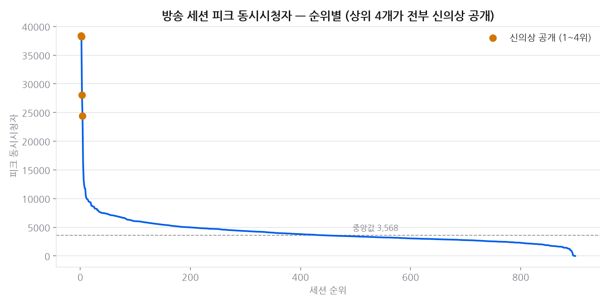
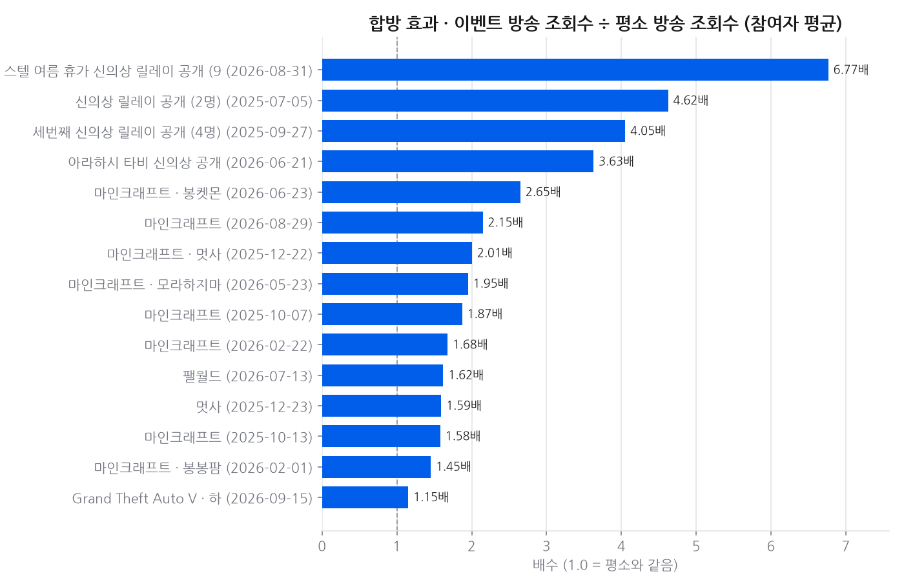
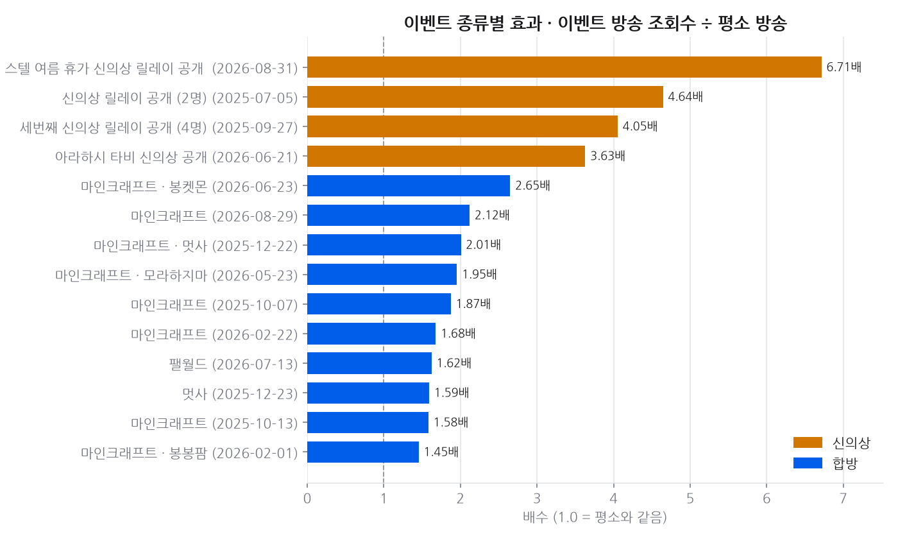
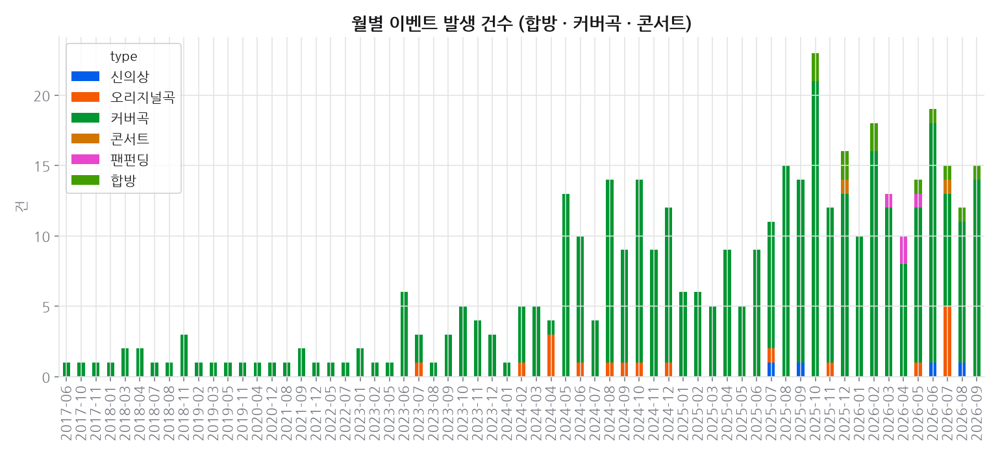

# 프로젝트 12 · 이벤트 임팩트

**기준 2026-09-03**  · 날짜별 축적

## 결론

**연속 며칠짜리 기획은 예외 없이 터진다.** 4명 이상이 연속 2일 이상 함께한 대규모 컨텐츠만 골라내면 **전부**가 참여자의 평소 방송 대비 1.5배 이상 조회수를 냈다(최고 2.9배, 마인크래프트 서버). 하루짜리 합방을 섞으면 이 비율이 절반으로 떨어진다 — 단발 합방과 며칠짜리 기획은 아예 다른 이벤트다. **같은 21일에 스텔라이브만 전원이 올랐다** — 11분의 1 규모에서 홀로라이브와 같은 수의 구독자를 더했고 이세계아이돌은 전원 감소했다. 커버의 배수는 그룹이 같은데(2.0~2.1배) 스텔라이브가 커버를 가장 자주 낸다. 다만 참여율은 셋 중 최저다 — 도달은 넓고 참여는 얕다. **팬덤의 돈은 플랫폼에 쌓이고 IP 회사엔 남지 않는다** — 스텔라이브는 DART 에 없어 못 재지만, 플랫폼(NAVER·SOOP)은 10년 연속 흑자에 이익률 18~27%, IP 회사(샌드박스)는 8년 연속 적자다. **팬은 자기 돈으로 광고를 낸다** — 팬 제작 생일·기념 광고 펀딩 4건이 목표의 3~5배를 모았고 1인당 3~4만원이다. 지출은 정기 구독(월 7천원) → 팬 광고(수만원) → 공식 굿즈(수십만원)로 목적에 따라 자릿수가 바뀌는데, 동종업계 감사 재무는 연속 영업적자다. **댓글 여론은 긍정/부정으로 가를 수 없다** — 긍정 80%·부정 1.7%이고 부정 5건은 전부 야구팀 얘기라 멤버를 향한 부정은 0건이다. 신호는 주제에 있다: 성격·개그 댓글이 가장 많고 가장 긍정적이고 좋아요도 방송내용·게임의 1.9배다 — 팬은 콘텐츠가 아니라 사람에 반응한다. **키리누키만은 기획할 수 없다** — 클립 표본의 77%가 어떤 이벤트 키워드에도 안 걸리고, 상위 클립은 「말 실수한 유니」 같은 방송 중 우연한 순간이다. 개별 클립은 본인 영상의 12% 수준이지만 공식 채널 밖 도달이고, 상위 3개 채널이 클립 조회수의 33%를 가져간다. **동시시청자는 '무엇을 하느냐'보다 '이벤트냐 아니냐'로 갈린다** — 카테고리를 바꿔서 얻는 건 2.1배, 시간대·요일은 1.2~1.5배인데 신의상 공개는 7~19배다. 관측된 세션 344건 중 상위 4개가 전부 신의상이고 4위와 5위 사이에만 2.4배 차이가 난다. 그런데 **가장 크게 터지는 건 합방이 아니라 신의상 공개다.** 조회수는 평소의 3.6~5.6배(합방 1.4~2.7배), 동시시청자 피크는 **7.4~19.3배**(같은 기간 나란히 돌던 10인 마인크래프트 합방은 1.0~1.7배)로 두 지표 모두 앞선다. 합방은 며칠에 걸쳐 **분량**을, 신의상은 하루에 **순간 최대치**를 만드는 성격이 다른 레버다. 천장이 가장 높은 건 **오리지널곡**이다 — MV 가 일반 영상의 6~18배, 같은 멤버의 커버곡과 비교해도 2~3배다(단 잴 수 있는 곡이 한 앨범 4곡뿐이라 경향이 아니라 사례다). 커버곡은 같은 기간 일반 영상의 **중앙값 4배**를 보고, 콜라보 커버가 더 잘 되지는 않는다(2026년 솔로·콜라보 조회수 중앙값이 같다). 콘서트는 **단독이냐 합동이냐**로 갈린다 — 본인 첫 단독 콘서트 후기 방송은 평소의 5.9배(안내 쇼츠 171만 회)였지만, 같은 멤버가 참여한 그룹 페스티벌은 1.2배였다. 합동 무대는 관심이 10명에게 나뉜다. 다만 팔로워·구독자 전후 비교는 일일 수집이 시작된 **2026-08-12 이후 이벤트만** 가능하고, **수익은 어떤 방법으로도 잴 수 없다** — 치지직·유튜브 모두 공개하지 않는다. 지어낸 추정 대신 노출량(조회수·동시시청자)을 대리 지표로 둔다.

---

## 데이터

- 기준일: 2026-09-03
- 데이터 소스: 01·02·03·08 의 기존 수집분 재사용 (신규 API 호출 없음)
- 이벤트 구간: 2017-06-01 ~ 2026-09-02 · 총 409건
- 구성: 커버곡 371건, 오리지널곡 18건, 합방 10건, 신의상 4건, 팬펀딩 4건, 콘서트 2건

## 한눈에

- **대규모 컨텐츠 10건**을 자동 감지했다 — 4명 이상이 **연속 2일 이상**
  함께한 기획만 이벤트로 본다. 마인크래프트 서버·봉켓몬·봉봉팜·팰월드처럼 며칠에 걸친
  기획이 그대로 잡힌다.
- 그 10건 중 **12건이 평소 방송 대비 1.5배 이상**의 조회수를 냈다.
  하루짜리를 섞었을 때는 이 비율이 절반 수준이었다 — **연속 기획만 남기면 효과가 선명해진다.**
  단발 합방과 며칠짜리 기획은 성격이 다른 이벤트다.
- **가장 크게 터지는 이벤트는 합방이 아니라 신의상 공개다.** 조회수는 평소의
  **3.6~5.6배**(합방은 1.4~2.7배), 동시시청자 피크는
  **7.3~19.3배**(같은 기간 나란히 돌던 10인 마인크래프트 합방은
  1.0~1.7배)였다. 사키하네 후야의 첫 신의상은 38,402명 — 평소 피크의 19배다.
- **천장이 가장 높은 건 오리지널곡이다.** MV 가 일반 영상의 6.3~17.8배,
  같은 멤버의 커버곡과 비교해도 2.3~9.6배다. 다만 잴 수 있는 곡이
  한 앨범(4곡)뿐이라 **경향이 아니라 사례**로 읽어야 한다.
- **커버곡은 평소 영상의 4.0배 본다**(같은 기간·성숙 영상만 비교). 콜라보 커버가
  더 잘 되지는 않는다 — 2026년 기준 솔로와 콜라보의 조회수 중앙값이 같다.
- **콘서트는 단독이냐 합동이냐로 갈린다.** 본인 첫 단독 콘서트의 후기 방송은 평소의
  5.9배(안내 쇼츠 1,713,954회)였지만, 같은 멤버가 참여한 그룹 페스티벌은
  1.1~2.7배였다. 합동은 관심이 10명에게 나뉜다.
- **같은 21일에 스텔라이브만 전원이 올랐다.** 구독자 +19,000명으로 11분의 1 규모의
  홀로라이브(+20,000명)와 같은 수를 더했고, 이세계아이돌은 전원 감소했다. 커버가 내는
  배수는 그룹이 같은데 스텔라이브가 커버 비중이 가장 높다 — 레버가 아니라 당기는 빈도가 다르다.
  다만 참여율은 셋 중 가장 낮다: 도달은 넓고 참여는 얕다.
- **팬덤의 돈은 플랫폼에 쌓이고 IP 회사엔 남지 않는다.** 스텔라이브는 DART 에 없어
  못 재지만, 같은 돈이 흐르는 양 끝단은 보인다 — 플랫폼(NAVER·SOOP)은 10년 연속 흑자에
  이익률 18%~27%, IP 회사는 샌드박스네트워크 8년 연속 적자.
- **팬은 돈을 쓴다, 자발적으로.** 팬 제작 광고 펀딩 4건이 목표의
  282~473%를 모았다(1인당 29,142~43,642원).
  지출은 정기 구독 만원 미만 → 팬 광고 수만원 → 공식 굿즈 수십만원으로 목적에 따라
  자릿수가 바뀐다. 그런데 동종업계 감사 재무는 연속 영업적자다 — 회사엔 남지 않는다.
- **댓글 여론은 긍정/부정으로 가를 수 없다.** 긍정 80%·부정 1.7%이고 부정
  5건은 전부 야구팀 얘기라 멤버를 향한 부정은 0건이다. 신호는 주제에 있다 —
  **성격·개그** 댓글이 가장 많고 가장 긍정적이고 좋아요도 방송내용·게임의
  1.9배다. 팬은 콘텐츠가 아니라 사람에 반응한다.
- **키리누키는 유일하게 기획할 수 없는 이벤트다.** 클립 표본의 77%가 어떤
  이벤트 키워드에도 안 걸린다 — 클립이 되는 건 기획이 아니라 방송 중 우연한 순간이다.
  개별 클립은 본인 영상의 12% 수준이지만 공식 채널 밖 도달이고,
  상위 3개 채널이 조회수의 33%를 가져간다.
- **동시시청자는 '무엇을 하느냐'보다 '이벤트냐 아니냐'로 갈린다.** 카테고리·시간대·요일을
  바꿔서 얻는 건 최대 2.1배(카테고리)지만, 신의상 공개는 7~19배를 만든다. 관측된
  세션 상위 4개가 전부 신의상이고 4위와 5위 사이에만 2.4배 차이가 난다.
- 전후 비교(팔로워·구독자·동시시청자)는 **일일 수집이 시작된 2026-08-12 이후 이벤트만**
  가능하다. 그 이전은 기준선이 없어 계산하지 않는다 — 0%가 아니라 측정 불가다.
- 최근 8건은 **관측 중**이다. 이벤트 후 5일이 지나야 전후 비교를 낸다 —
  창이 안 찬 상태로 계산하면 관측 부족이 지표 폭락으로 둔갑한다.
- **수익은 어떤 방법으로도 잴 수 없다.** 치지직 후원·구독 수익도 유튜브 광고 수익도
  공개되지 않는다. 대리 지표로 노출량(동시시청자 피크·조회수)만 낸다.

## 상세 분석

### 이 프로젝트가 따로 있는 이유

다른 프로젝트는 "지금 얼마인가"를 답한다. 이 프로젝트는 **"무슨 일이 있어서 그렇게
됐는가"**를 답한다. 대규모 합방·커버곡 발매·콘서트 같은 사건을 자동으로 찾아 기억하고,
그 전후로 팔로워·구독자·동시시청자가 어떻게 움직였는지 붙인다.

이벤트는 손으로 적어 두지 않으면 잊힌다. 그래서 치지직 VOD 의 제목과 카테고리에서
합방을 자동 감지하고(`collect.py`), 처음 감지한 날짜를 `data/events_seen.csv` 에
append-only 로 남긴다.

### 합방 효과 — 이벤트 방송 조회수 ÷ 평소 방송 (소급 가능)

| 날짜 | 이벤트 | 참여자 평균 배수 |
|---|---|---|
| 2026-08-31 | 스텔 여름 휴가 신의상 릴레이 공개 (8명) | 5.57배 |
| 2025-09-27 | 세번째 신의상 릴레이 공개 (4명) | 4.11배 |
| 2025-07-05 | 신의상 릴레이 공개 (3명) | 3.86배 |
| 2026-06-21 | 아라하시 타비 신의상 공개 | 3.61배 |
| 2026-06-23 | 마인크래프트 · 봉켓몬 | 2.66배 |
| 2025-12-22 | 마인크래프트 · 멋사 | 2.00배 |
| 2026-05-23 | 마인크래프트 · 모라하지마 | 1.95배 |
| 2025-10-07 | 마인크래프트 *(진행 중)* | 1.87배 |
| 2026-02-22 | 마인크래프트 *(진행 중)* | 1.68배 |
| 2026-07-13 | 팰월드 | 1.63배 |

### 신의상 효과 — 가장 크게 터지는 이벤트

같은 기간에 나란히 돌아도 신의상 공개가 합방을 두 지표 모두에서 앞선다.

| 지표 | 신의상 공개 | 대규모 합방 |
|---|---|---|
| VOD 조회수 배수 | **3.6~5.6배** | 1.4~2.7배 |
| 동시시청자 피크 배수 | **7.3~19.3배** | 1.0~1.7배 |

| 멤버 | 공개일 피크 | 평소 피크 | 배수 |
|---|---|---|---|
| 사키하네 후야 | 38,402 | 1,991 | **19.28배** |
| 아라하시 타비 | 38,237 | 4,086 | **9.36배** |
| 네네코 마시로 | 28,071 | 3,568 | **7.87배** |
| 하나코 나나 | 24,385 | 3,316 | **7.35배** |

신의상은 **연 몇 회짜리 희소 이벤트**다. 합방은 며칠씩 이어지며 조회수를 꾸준히
끌어올리는 반면, 신의상은 하루 몇 시간에 평소의 몇 배가 몰린다. 성격이 다른 두
레버로 봐야 한다 — 합방은 **분량**, 신의상은 **순간 최대치**다.

### 오리지널곡 효과 — 가장 높은 천장

| 곡 | 멤버 | 공개일 | MV 조회수 | 일반 중앙 | 일반 대비 | 커버 대비 |
|---|---|---|---|---|---|---|
| Maid My Way | 아오쿠모 린 | 2026-07-27 | 1,730,647 | 97,174 | **17.8배** | 2.3배 |
| 악당주의보 | 유즈하 리코 | 2026-07-24 | 1,353,768 | 131,226 | **10.3배** | 9.6배 |
| Hush Trap | 하나코 나나 | 2026-07-26 | 960,470 | 116,811 | **8.2배** | 2.8배 |
| Berry Verry Strawberry | 텐코 시부키 | 2026-07-25 | 1,019,846 | 160,731 | **6.3배** | 2.4배 |

오리지널곡 MV 는 그 멤버의 일반 영상보다 **6.3~17.8배** 본다. 같은 멤버의
커버곡과 비교해도 **2.3~9.6배**다. 지금까지 잰 이벤트 중 단일 콘텐츠로는
천장이 가장 높다.

발매는 한 편이 아니라 **묶음으로 굴러간다.** 곡마다 관련 영상이 7~11편 붙는다 —
티저(2~3일 전) → MV → 홍보 쇼츠 5~6편. 유즈하 리코의 「악당주의보」는 발매 한 달
뒤에도 댄스 챌린지 쇼츠(8/27·9/1)로 다시 20만 회씩 나왔다.

⚠ **표본은 한 앨범뿐이다.** 잴 수 있는 오리지널곡은 cliché 1st EP 「Colorful Strokes」
수록곡 4개가 전부다. 나머지 오리지널곡(2023~2026)은 일반 영상 목록이 멤버당 최근
50개뿐이라 데이터에 없다. **"오리지널곡은 커버의 2배"가 아니라 "이 앨범은 그랬다"**로
읽어야 한다. 유즈하 리코의 커버 대비 배수(9.6배)가 유독 큰 것도 곡이 세서가
아니라 그의 커버 중앙값이 낮은 탓이다(아래 커버곡 절 참고).

### 커버곡 효과 — 평소 영상의 4배

커버는 2017년부터 있고 일반 영상 목록은 멤버당 최근 50개뿐이다. 그냥 비교하면
오래 쌓인 커버가 최근 일반 영상을 이기는 게 당연해진다 — 효과가 아니라 **누적 시간**을
재게 된다. 그래서 **같은 기간 안에서만**, 그리고 업로드 14일이 안 지난 영상은
커버·일반 **양쪽 모두에서** 빼고 비교했다.

| 멤버 | 커버 | 커버 중앙 조회수 | 일반 중앙 조회수 | 배수 |
|---|---|---|---|---|
| 아오쿠모 린 | 2곡 | 765,066 | 103,221 | **7.41배** |
| 아라하시 타비 | 2곡 | 644,822 | 101,515 | **6.35배** |
| 시라유키 히나 | 2곡 | 469,008 | 99,326 | **4.72배** |
| 아카네 리제 | 2곡 | 629,390 | 135,001 | **4.66배** |
| 아야츠노 유니 | 1곡 | 363,171 | 87,259 | **4.16배** |
| 네네코 마시로 | 2곡 | 225,963 | 58,582 | **3.86배** |
| 하나코 나나 | 2곡 | 348,000 | 99,772 | **3.49배** |
| 사키하네 후야 | 1곡 | 260,676 | 88,532 | **2.94배** |
| 텐코 시부키 | 1곡 | 427,451 | 152,126 | **2.81배** |
| 유즈하 리코 | 7곡 | 140,956 | 167,102 | **0.84배** |

커버곡은 그 멤버의 일반 영상보다 **중앙값 4.0배** 본다. 10명 중 9명이 2.8~7.4배에
들어간다.

**콜라보 커버가 더 잘 되지는 않는다.** 2026년 커버만 놓고 보면 솔로 363,171회 ·
콜라보 357,060회로 차이가 없다. 전체 기간으로는 콜라보가 높아 보이는데, 콜라보 커버가
**2024년부터만 존재해서** 생기는 착시다(그 이전 카탈로그는 전부 솔로).

### 읽을 때 주의

유즈하 리코만 0.84배로 유일하게 1배 미만이고, 동시에 커버를 가장 자주 올린다
(월 4.5곡 · 다른 멤버는 0.3~1.2곡). "자주 올리면 효과가 희석된다"로 읽고 싶어지고
실제로 빈도와 배수의 상관은 -0.53이다. **그런데 리코 한 명을 빼면 +0.32로 뒤집힌다.**
표본 하나가 만든 상관이라 인과로 말할 수 없다.

더 그럴듯한 설명은 표본 수다. 다른 멤버는 창 안에 커버가 1~2곡뿐이라 그 중앙값이
"잘 된 한 곡"일 수 있는 반면, 리코는 7곡이라 평범한 곡까지 포함된 중앙값이다.
멤버별 배수 **순위**는 이 이유로 신뢰하지 말고, "커버는 일반 영상보다 몇 배 본다"는
**전체 경향**만 읽는 편이 안전하다.

### 콘서트 효과 — 단독과 합동은 다르다

콘서트는 오프라인·유료라 **행사 중에는 방송이 없다.** 그래서 기간 안을 세면 0건이다.
효과는 주변에 나타난다 — 선예매·매진 인증·D-3 카운트다운·후기 방송. 콘서트 전후
7일의 관련 방송을 그 멤버의 평소 방송과 비교했다.

| 콘서트 | 멤버 | 관련 방송 | 최고 조회수 | 평소 | 배수 |
|---|---|---|---|---|---|
| 2026-07-11 아카네 리제 첫 단독 콘서트 | 아카네 리제 | 4건 | 13,512 | 2,289 | **5.90배** |
| 2025-12-20 2025 THE 1ST STELLIVE  | 시라유키 히나 | 2건 | 11,440 | 4,268 | **2.68배** |
| 2025-12-20 2025 THE 1ST STELLIVE  | 사키하네 후야 | 1건 | 3,547 | 2,726 | **1.30배** |
| 2025-12-20 2025 THE 1ST STELLIVE  | 유즈하 리코 | 1건 | 5,041 | 4,182 | **1.21배** |
| 2025-12-20 2025 THE 1ST STELLIVE  | 아카네 리제 | 7건 | 3,929 | 3,264 | **1.20배** |
| 2025-12-20 2025 THE 1ST STELLIVE  | 하나코 나나 | 1건 | 3,964 | 3,790 | **1.05배** |

**본인 단독 콘서트가 그룹 합동보다 훨씬 크게 남는다.** 아카네 리제의 첫 단독 콘서트
후기 방송은 평소의 5.9배였고, 콘서트 안내 쇼츠는 **1,713,954회**로 그 채널
최상위권이다. 반면 같은 멤버가 참여한 그룹 페스티벌(2025-12-20)의 후기 방송은
1.1~2.7배에 그쳤다. 합동 무대는 관심이 10명에게 나뉘지만 단독 콘서트는
그 멤버에게 몰린다.

⚠ **구독자·팔로워 전후 비교는 두 콘서트 모두 불가능하다.** 일일 축적이 2026-08-12에
시작됐는데 콘서트는 2025-12-20과 2026-07-11이라 기준선이 존재하지 않는다. 위 숫자는
**방송 조회수로 잰 간접 지표**이고, "콘서트로 구독자가 몇 % 늘었다"는 아직 말할 수 없다.
다음 콘서트부터는 전후 비교가 자동으로 붙는다.

### 경쟁사 비교 효과 — 같은 21일, 스텔라이브만 전원이 올랐다

경쟁사는 치지직 데이터가 없어 합방·신의상은 볼 수 없다. 볼 수 있는 건 유튜브다 —
같은 기간의 구독자 성장, 최근 업로드 중 커버 비중, 커버가 일반 영상 대비 몇 배인지.
앞 절들이 스텔라이브에서 찾은 **이벤트 중심 구조가 경쟁사에도 있는가**를 묻는다.

### 같은 기간 성장 (2026-08-12 → 2026-09-02, 21일)

| 그룹 | 구독자 합계 | 증감 | 성장률 | 멤버 중앙값 | 오른 멤버 | 내린 멤버 |
|---|---|---|---|---|---|---|
| StelLive | 1,608,000 | **+19,000** | **+1.20%** | +1.62% | 6/6 | 0/6 |
| 홀로라이브 | 18,050,000 | **+20,000** | **+0.11%** | +0.00% | 2/6 | 1/6 |
| 이세계아이돌 | 2,476,000 | **-6,000** | **-0.24%** | -0.24% | 0/6 | 6/6 |

스텔라이브는 6명 전원이 올랐고, 이세계아이돌은 6명이 내렸으며, 홀로라이브는 사실상 제자리다.

성장률 상위 4명은 전부 StelLive, 하위 4명은 전부 이세계아이돌이다. 그룹이 섞이지 않는다.

### 이벤트 밀도 — 커버는 스텔라이브가 가장 많이, 효과는 똑같이

| 그룹 | 주당 업로드 | 최근 업로드 중 커버 | 커버 ÷ 일반 영상 |
|---|---|---|---|
| StelLive | 3.5편 | **4.4%** (8편) | 2.04배 |
| 홀로라이브 | 4.6편 | **0.0%** (0편) | 커버 없음 |
| 이세계아이돌 | 4.2편 | **1.7%** (3편) | 2.14배 |

스텔라이브는 세 그룹 중 **업로드는 가장 적게 하면서 커버 비중은 가장 높다.** 그리고
커버가 일반 영상 대비 내는 배수는 StelLive 2.04배 · 이세계아이돌 2.14배로 거의 같다 — **커버라는 레버 자체는 그룹을 가리지
않는다.** 차이는 레버의 세기가 아니라 **얼마나 자주 당기느냐**다.

### 도달은 넓고 참여는 얕다

| 그룹 | 구독자 중앙값 | 도달 효율 | 참여율 |
|---|---|---|---|
| StelLive | 289,500 | **0.65** | 3.5% |
| 홀로라이브 | 2,710,000 | **0.11** | 6.6% |
| 이세계아이돌 | 415,000 | **0.22** | 5.7% |

스텔라이브는 도달 효율(평균 조회수/구독자)이 압도적으로 높지만 **참여율은 셋 중 가장
낮다.** 조회수가 깊은 팬의 반복 시청이 아니라 넓은 도달에서 온다는 뜻이다. 앞 절의
"팬은 사람에 반응한다"(댓글)와 "신의상이 동시시청자를 10배 만든다"(치지직)는 이 얕은
유튜브 참여를 치지직 쪽 깊이가 보완하는 그림으로 읽힌다.

⚠ **21일·그룹당 6명·1,000 단위 반올림**이다. 홀로라이브 270만 채널은 +999명이
늘어도 0으로 보이므로 상대 성장률 비교는 스텔라이브에 유리하다. 절대 증가로는
스텔라이브 +19,000명 · 홀로라이브 +20,000명으로 **11분의 1 규모에서 같은
수를 더했다**가 정확한 진술이다.

### DART 재무 효과 — 팬덤의 돈은 플랫폼에 쌓이고 IP 회사엔 남지 않는다

**스텔라이브는 잴 수 없다.** 스텔라이브·브레이브그룹코리아·브레이브그룹이(가) DART 기업코드 마스터에 없다 — 비상장·
소규모라 외부감사 대상이 아니거나 국내 법인이 아닐 수 있다. 그래서 회사 자체 대신,
같은 팬 지출이 흘러가는 **양 끝단**을 감사 재무로 본다: 후원·구독 수수료를 받는
**플랫폼**과 굿즈·콘텐츠를 파는 **IP 회사**.

### 플랫폼 — 10년 연속 흑자, 이익률 20%대

| 회사 | 기간 | 최근 매출 | 최근 영업이익 | 영업이익률 | 이익률 범위 | 매출 성장 | 연속 |
|---|---|---|---|---|---|---|---|
| NAVER | 2016~2025 | 120,350억 | **+22,081억** | +18.3% | +11%~+27% | 3.0배 | 흑자 10년 |
| SOOP | 2016~2025 | 4,666억 | **+1,248억** | +26.8% | +19%~+34% | 5.8배 | 흑자 10년 |

### IP 회사 — 적자가 구조다

| 회사 | 기간 | 최근 매출 | 최근 영업이익 | 영업이익률 | 이익률 범위 | 매출 성장 | 연속 |
|---|---|---|---|---|---|---|---|
| 샌드박스네트워크 | 2018~2025 | 731억 | **-43억** | -5.8% | -22%~-6% | 2.6배 | 적자 8년 |
| 패러블엔터테인먼트 | 2024~2025 | 218억 | **-91억** | -41.7% | -42%~+6% | 1.0배 | 적자 1년 |

### 같은 돈의 두 얼굴

앞 절(팬 커머스)이 보여준 팬 지출은 이 두 표 사이 어딘가로 흐른다. 치지직 후원·구독의
수수료는 NAVER 로, 굿즈·앨범·콘서트는 IP 회사로. 그리고 **플랫폼은 18%~27%의
영업이익률로 매년 남기고, IP 회사는 샌드박스네트워크 8년 연속 적자이다.** SOOP 은 매출이
5.8배로 커지는 동안 이익률이 더 올라갔고, 샌드박스는 매출이 정점의 절반으로
줄어도 적자가 이어진다.

이건 스텔라이브에 대한 진술이 아니라 **스텔라이브가 놓인 구조**에 대한 진술이다. 같은
구조 안에서 스텔라이브만 다르다고 볼 근거는 (비공개라) 없고, 다르지 않다고 볼 근거도 없다.

⚠ **치지직의 기여는 NAVER 재무에서 분리되지 않는다.** NAVER 매출 120,350억 중
치지직 몫은 공시되지 않는다. 스트리밍 전업인 SOOP 이 플랫폼 경제의 더 나은 대리 지표다.
⚠ 샌드박스의 2023년 매출 급감(-54%)은 사업 구조조정이지 팬덤 축소가 아니고, 패러블은
공시가 2년치뿐이라 추세를 말할 수 없다.

### 팬 커머스 효과 — 팬은 돈을 쓴다, 자발적으로, 그런데 회사엔 남지 않는다

스텔라이브 회사 재무는 **비공개**(DART 미등록)라 매출·굿즈 판매를 직접 잴 수 없다.
대신 세 겹의 간접 지표를 쓴다.

### ① 팬이 자기 돈으로 광고를 낸다 — 스텔라이브에 특정된 유일한 커머스 데이터

| 프로젝트 | 시작 | 모금액 | 후원자 | 1인당 | 달성률 |
|---|---|---|---|---|---|
| 유니버스 데뷔 3주년 기념 광고 프로젝트 | 2026-03-01 | 37,856,556원 | 973명 | 38,907원 | **473%** |
| 2026 사키하네 후야 생일 광고 | 2026-04-01 | 30,244,027원 | 693명 | 43,642원 | **302%** |
| [팬메이드] 2026 하나코 나나 생일 광고 | 2026-04-20 | 22,576,103원 | 523명 | 43,167원 | **282%** |
| 2026 아라하시 타비 생일 광고 | 2026-05-25 | 26,810,200원 | 920명 | 29,142원 | **470%** |

이 4건은 **회사가 판 게 아니다.** 팬들이 텀블벅에서 스스로 돈을 모아 멤버 생일·
기념일 광고를 낸 것이다. 합계 **117,486,886원 · 3,109명**, 1인당
29,142~43,642원, 목표 대비 **282~473%** 달성.
굿즈처럼 손에 남는 것도 없이 오직 "내 멤버를 알리는 데" 3~4만원을 내는 사람이
한 건당 500~1,000명이다. 이건 매출이 아니라 **팬덤 결속력의 직접 측정치**다.

### ② 지출은 목적에 따라 자릿수가 달라진다

| 지출 유형 | 1인당 | 출처 |
|---|---|---|
| 정기 구독 (팬딩, 월) | 중앙값 **7,200원** · 상위 25% 11,000원 | 버튜버 크리에이터 67개 티어 |
| 팬 제작 광고 펀딩 | **29,142~43,642원** | 스텔라이브 4건 |
| 공식 굿즈 펀딩 | **133,996~247,819원** | 이세계아이돌 2건 (최대 8,822,342,758원) |

같은 팬덤 안에서 정기 구독에는 만원 미만, 자발적 광고에는 수만원, 한정 굿즈에는
수십만원을 낸다. **정기 지출과 이벤트성 지출 사이에 10~30배 차이**가 있다. 팬 커머스는
"매달 얼마"가 아니라 "이벤트에 얼마"로 움직인다 — 앞 절들이 보여준 이벤트 중심
구조와 같은 모양이다.

⚠ 이세계아이돌 펀딩은 공식, 스텔라이브 4건은 비공식 팬 제작이라 **규모를 직접 비교하면
안 된다.** 88억 대 3.8천만의 차이는 팬덤 크기가 아니라 공식/비공식의 차이다.

### ③ 매진은 확인되지만 금액은 알 수 없다

- 2026-06-06 아카네 리제 — 「천마콘 선예매 매진 감사합니댜!! (비틱비 단가: 혈액팩) 근데 일반예매」
- 2026-06-11 아카네 리제 — 「!!!❤️리제 3주년❤️!!! 솔로콘서트 콘서트 매진 감사합니다!!!!!」
- 2026-06-12 아카네 리제 — 「!!!❤️리제 3주년❤️!!! 솔로콘서트 콘서트 매진 감사합니다!!!!!」
- 2026-06-19 아카네 리제 — 「콘서트 매진 내기로 공포게임 해야하는 청년의 공겜정하기」

티켓·굿즈 판매액은 어디에도 공개되지 않는다. 방송 제목에 남는 "매진"이 판매 신호의
전부다.

### ④ 그런데 회사에는 남지 않는다

| 회사 | 연도 | 매출 | 영업이익 | 영업이익률 |
|---|---|---|---|---|
| 샌드박스네트워크 | FY2025 | 731억 | **-43억** | -5.8% |
| 패러블엔터테인먼트 | FY2025 | 218억 | **-91억** | -41.7% |

같은 IP 구조로 운영되는 동종업계의 감사받은 재무다. 팬이 이만큼 쓰는데도 영업이익은
연속 적자다. **팬 지출과 회사 수익성 사이에 구조적 간극**이 있고, 스텔라이브가 다르다고
말할 근거는 (비공개라) 없다.

### 댓글 여론 효과 — 긍정/부정은 변별력이 없고, 신호는 '무엇에 반응하나'에 있다

라벨링한 댓글 300건(멤버 10명 × 30건, 영상 40편)의 감성은
긍정 **80%** · 중립 18% · 부정 **1.7%**다. 부정은 5건뿐이고,
**전부 아야츠노 유니의 영상 2편에 몰려 있다** — 내용은 야구팀 얘기
("롯데 추천한 놈…")지 멤버에 대한 것이 아니다. 즉 **멤버를 향한 부정 댓글은 표본에
0건**이다. 팬 채널 댓글에서 긍정/부정 비율은 아무것도 가르지 못한다.

### 팬은 콘텐츠가 아니라 사람에 반응한다

| 주제 | 댓글 수 | 긍정 | 부정 | 좋아요 중앙값 |
|---|---|---|---|---|
| 성격·개그 | 88건 | 99% | 0% | 460 |
| 방송내용·게임 | 84건 | 74% | 0% | 248 |
| 외형·디자인 | 37건 | 92% | 0% | 194 |
| 기타 | 34건 | 24% | 15% | 318 |
| 목소리·노래 | 31건 | 90% | 0% | 220 |
| 성장·추억 | 14건 | 100% | 0% | 152 |
| 멤버 간 케미 | 12건 | 67% | 0% | 133 |

가장 많고(**88건**), 가장 긍정적이고(99%), 가장 많이 호응받는
(좋아요 중앙값 **460**) 주제가 **성격·개그**이다. 방송 내용·게임 댓글의
좋아요 중앙값(248)보다 **1.9배** 높다. 게임 실력이나 노래보다
**그 사람 자체**에 대한 댓글이 팬덤에서 가장 크게 호응받는다.

### 감성 점수는 성장을 예측하지 못한다

멤버별 감성 점수(0.33~0.93)와 최근 21일 치지직 팔로워 성장률의 상관은 **+0.28**(n=10)다. 방향이 있다고 말할 수준이 아니다. 점수 자체도 멤버 간 차이가 거의 없다 — 최저인 멤버도 표본이 야구 영상에 쏠린 탓이지 여론이 나빠서가 아니다.

### 이벤트별 여론 비교는 못 한다

댓글 표본이 걸린 영상 40편 중 커버곡 2편·오리지널곡 1편·합방 1편뿐이라,
"신의상 댓글이 더 긍정적인가" 같은 질문은 이 데이터로 답할 수 없다. 이벤트별 여론을
보려면 05 수집을 이벤트 영상 중심으로 넓혀야 한다.

### 키리누키 효과 — 유일하게 기획할 수 없는 이벤트

| 멤버 | 클립 | 클립 총조회 | 클립 중앙 | 본인 영상 중앙 | 비율 | 채널 |
|---|---|---|---|---|---|---|
| 텐코 시부키 | 23편 | 4,918,990 | 94,996 | 142,732 | 0.67배 | 15개 |
| 네네코 마시로 | 48편 | 3,298,216 | 6,252 | 62,574 | 0.10배 | 17개 |
| 아카네 리제 | 28편 | 2,971,055 | 17,063 | 177,859 | 0.10배 | 12개 |
| 아야츠노 유니 | 36편 | 2,846,026 | 10,300 | 94,891 | 0.11배 | 18개 |
| 시라유키 히나 | 30편 | 1,647,723 | 10,149 | 111,339 | 0.09배 | 14개 |
| 하나코 나나 | 25편 | 1,411,497 | 19,549 | 115,854 | 0.17배 | 15개 |
| 아라하시 타비 | 43편 | 1,245,401 | 12,376 | 102,535 | 0.12배 | 9개 |
| 유즈하 리코 | 27편 | 1,218,657 | 26,019 | 167,810 | 0.16배 | 11개 |
| 아오쿠모 린 | 11편 | 1,084,850 | 45,155 | 107,749 | 0.42배 | 5개 |
| 사키하네 후야 | 26편 | 75,213 | 1,814 | 85,415 | 0.02배 | 4개 |

**클립 하나는 작지만 수가 많고, 공식 채널 밖에 있다.** 클립 조회수 중앙값은 그 멤버
영상의 **12%** 수준이다(멤버별로 2%~67%로 편차가 크다 — 사키하네 후야가
0.02배로 최저인 건 2025-09 데뷔라 클립 생태계가 아직 얇기 때문이고, 텐코 시부키가
0.67배로 최고인 건 역대 1위 클립을 포함한 소수의 큰 클립이 끌어올린 결과다). 대신 멤버당 11~48편이 72개 채널에서
나오고, 이건 전부 **본인이 올리지 않은 도달**이다.

### 무엇이 클립이 되나 — 이벤트가 아니라 순간이다

| 주제 | 클립 수 | 비중 | 조회수 중앙값 |
|---|---|---|---|
| 커버·노래 | 59편 | 19.9% | 21,587 |
| 게임 | 4편 | 1.3% | 43,596 |
| 합방·서버 | 3편 | 1.0% | 4,052 |
| 신의상 | 2편 | 0.7% | 42,742 |
| **어느 것도 아님** | — | **77.4%** | — |

여기가 다른 이벤트와 갈리는 지점이다. 표본 297건 중 **77%가 어떤
이벤트 키워드에도 걸리지 않는다.** 상위 클립 제목이 「말 실수한 유니」·「하이요 얼굴
공개 ㄷㄷ」·「힘드신군뇨」처럼 **방송 중 우연한 순간**이다. 커버·노래만 예외적으로
20%를 차지하고, 실제로 역대 1위 클립도 커버 라이브다.

오리지널곡·신의상·콘서트는 **기획해서 만들 수 있다.** 키리누키는 그럴 수 없다 —
날짜를 잡을 수도, 무엇이 클립이 될지 고를 수도 없다. 지금까지 정리한 이벤트 중
**유일하게 통제 밖에 있는 레버**다.

### 생태계는 소수 채널이 끈다

클립 297건이 72개 채널에서 나오는데, **상위 3개 채널이 조회수의
33%, 상위 10개가 63%**를 가져간다. 2차창작이 넓게 퍼져 있다기보다
몇 개의 전문 채널이 생태계를 끌고 간다.

⚠ `clips.csv` 는 검색으로 모은 **표본**이지 전수가 아니다. 멤버별 클립 수는 실제
생산량이 아니라 검색이 건진 양이고, 인기 클립 쪽으로 치우쳐 있다. 위 비율은
**상한**으로 읽어야 한다 — 전수라면 더 낮아진다.

### 동시시청자 효과 — 이벤트냐 아니냐로 갈린다

관측된 방송 세션 355건의 피크 분포는 심하게 치우쳐 있다 — 중앙값 **3,567명**, 상위 5% 7,523명, 상위 1% 16,664명, 최대 **38,402명**. 평균 근처에 몰려 있는 게 아니라 꼬리가 길다.

| 순위 | 날짜 | 멤버 | 피크 | 방송 |
|---|---|---|---|---|
| 1 | 08-31 | 사키하네 후야 | **38,402** | 첫 신의상 공개해요... 구경 오실래요...?😳 |
| 2 | 08-31 | 아라하시 타비 | **38,237** | [🏖️스텔 여름 휴가 신의상🏖️] 알아하시는 타비 현재 |
| 3 | 09-01 | 네네코 마시로 | **28,071** | ☀️🏖️수영복 신의상 공개🏖️☀️ |
| 4 | 09-01 | 하나코 나나 | **24,385** | 수영복 신의상 공개해요~! 대충 비가 와도 여름이니까  |
| 5 | 08-31 | 사키하네 후야 | **10,086** | 척추가 아프지만 조금만 더 칭찬 받고 싶다! |

**평소 요인은 이벤트에 비하면 미미하다.** 세션 5건 이상인 구간만 놓고 보면 —

| 요인 | 중앙값 범위 | 최대/최소 |
|---|---|---|
| 카테고리 | 2,663 ~ 5,518명 (음악/노래가 최고) | 2.1배 |
| 시작 시간대 | 3,141 ~ 3,735명 | 1.2배 |
| 요일 | 3,088 ~ 4,594명 | 1.5배 |

가장 큰 카테고리조차 2.1배다. 반면 신의상 공개는 같은 멤버의 평소 피크 대비
**7~19배**를 찍는다. 자릿수가 다르다.

즉 동시시청자는 **무엇을 하느냐보다 이벤트냐 아니냐**로 결정된다. 게임 선택이나
방송 시간을 바꿔서 얻는 건 잘해야 수십 %지만, 이벤트 하나가 하루에 10배를 만든다.

관측 구간의 상위 5개 중 **1~4위가 전부 신의상 공개**이고, 4위와 5위 사이에만
2.4배 차이가 난다. 상위권은 평소 방송과 아예 다른 구간이다.

### 동시시청자 피크 (2026-08-12 이후)

| 날짜 | 이벤트 | 멤버 | 이벤트 피크 | 평소 피크 | 배수 |
|---|---|---|---|---|---|
| 2026-08-31 | 스텔 여름 휴가 신의상 릴레이 공개 (8명) | 사키하네 후야 | 38,402 | 1,991 | 19.28배 |
| 2026-08-31 | 스텔 여름 휴가 신의상 릴레이 공개 (8명) | 아라하시 타비 | 38,237 | 4,086 | 9.36배 |
| 2026-08-31 | 스텔 여름 휴가 신의상 릴레이 공개 (8명) | 네네코 마시로 | 28,071 | 3,568 | 7.87배 |
| 2026-08-31 | 스텔 여름 휴가 신의상 릴레이 공개 (8명) | 하나코 나나 | 24,385 | 3,316 | 7.35배 |
| 2026-08-29 | 마인크래프트 | 아오쿠모 린 | 5,957 | 3,463 | 1.72배 |
| 2026-08-29 | 마인크래프트 | 네네코 마시로 | 5,750 | 3,425 | 1.68배 |
| 2026-08-29 | 마인크래프트 | 텐코 시부키 | 7,381 | 4,817 | 1.53배 |
| 2026-08-29 | 마인크래프트 | 아라하시 타비 | 5,844 | 4,064 | 1.44배 |

### 팔로워·구독자 전후 변화 (2026-08-12 이후)

| 날짜 | 이벤트 | 멤버 | 지표 | 이전(일평균) | 이후(일평균) | 변화 |
|---|---|---|---|---|---|---|
| 2026-08-22 | [4K] 숨바꼭질 かくれんぼ - AliA / 유 | 유즈하 리코 | 치지직 팔로워 | +97 | +182 | +87.0% |
| 2026-08-22 | [4K] 숨바꼭질 かくれんぼ - AliA / 유 | 유즈하 리코 | 유튜브 구독자 | +143 | +250 | +75.0% |

### 데이터 함정

- **합방 자동 감지는 치지직 방송이 있어야 한다.** 유튜브에서만 진행한 합방이나
  오프라인 행사는 잡히지 않는다. `data/events_manual.csv` 에 손으로 적어야 한다.
- **준비·리액션 방송은 이벤트가 아니다.** 설명회·클립 월드컵·명장면 월드컵처럼
  본편 주변에서 흩어져 나오는 방송은 연속일 기준에 걸려 자동으로 빠진다.
  실제로 봉누도를 이 준비 구간만 보고 이벤트로 등록했다가 되물렸다.
- **오리지널곡은 자동 감지되지 않는다.** 02는 커버곡만 수집하므로, 오리지널 발매는
  수동 등록 대상이다.
- **유튜브 구독자는 1,000 단위 반올림**이라 이벤트 다음날 변화가 계단으로만 보인다.
  7일 창으로만 낸 이유다. 짧은 창은 치지직 팔로워(정확한 정수)를 볼 것.
- **조회수 배수는 시간이 지날수록 커진다.** VOD 조회수는 누적이라 오래된 이벤트가
  유리하다. 같은 시기 이벤트끼리 비교할 것. *(진행 중)* 표시가 붙은 건 아직 조회수가
  쌓이는 중이라 실제보다 낮게 나온다.
- **동시시청자는 방송형 이벤트(합방·콘서트)에만 붙인다.** 곡 발매는 유튜브 업로드지
  방송이 아니라서, 발매일에 마침 큰 합방이 돌면 그 피크가 곡의 효과로 둔갑한다.

## 근거 자료

### 차트 4종 (최신 실행 2026-09-03 기준)

## 원자료

이 리포트를 만든 코드와 데이터는 저장소의 [`youtube_analyze_all/12_event_impact/`](../../youtube_analyze_all/12_event_impact/) 에 있다.

| 경로 | 내용 |
|---|---|
| `collect.py` | 수집 |
| `analyze.py` | 정제·집계·차트 생성 |
| `data/` | 원천·정제 데이터 (CSV/JSON) |
| `sql/` | 스키마·INSERT·분석쿼리·SQLite·쿼리 실행결과 |
| `site/index.html` | 자체완결 인터랙티브 대시보드 |
| `data/history.csv` | 날짜별 지표 축적 (이 리포트의 추세 절 근거) |
